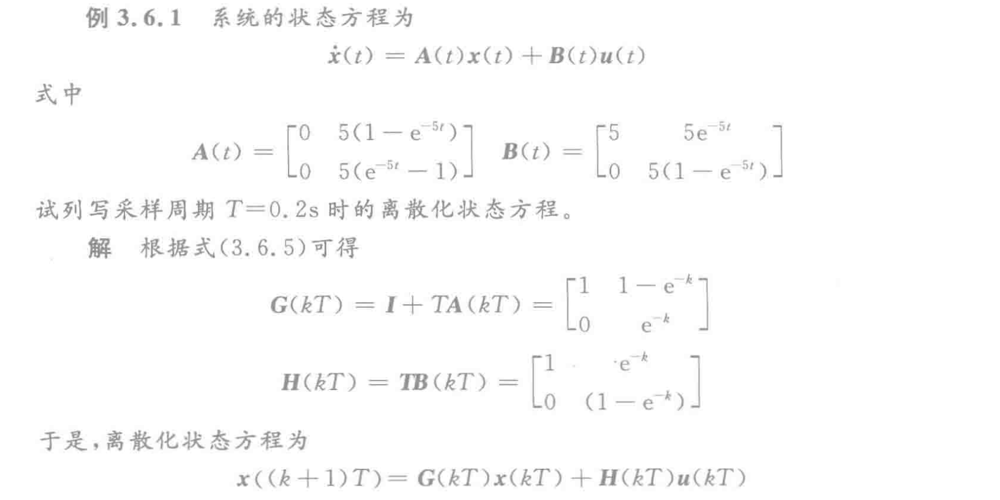
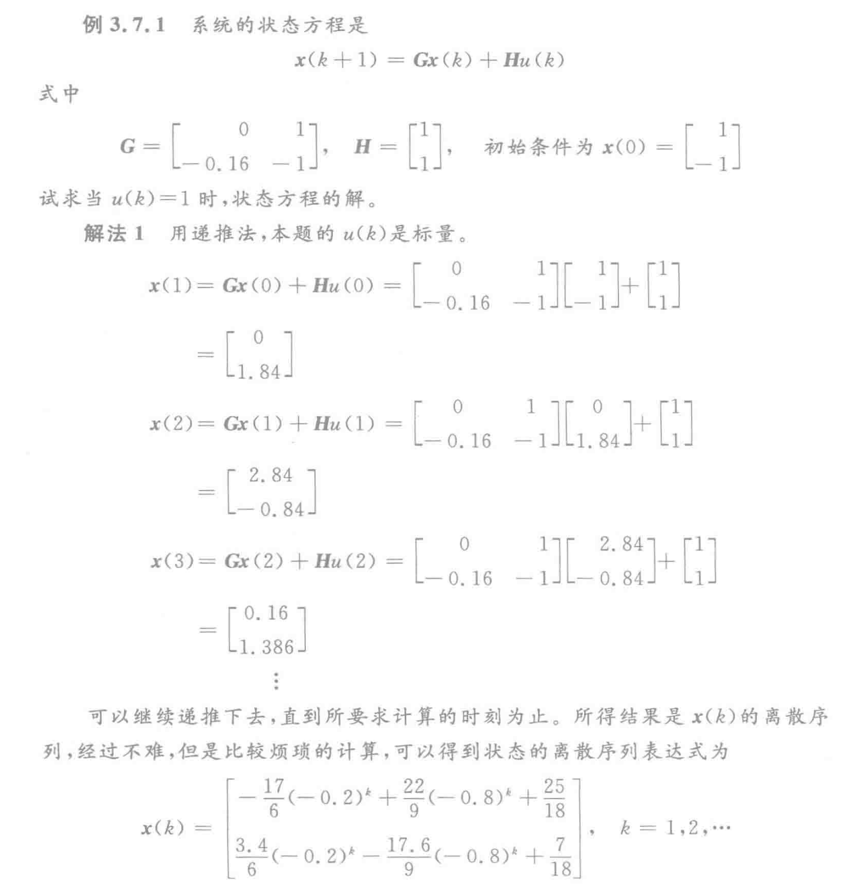
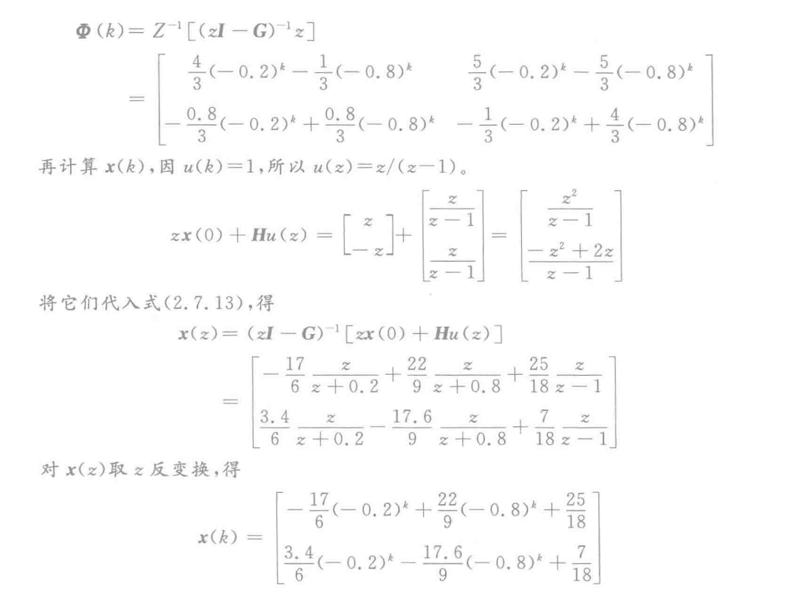

# 3. 第三章

- [3. 第三章](#3-第三章)
  - [3.1 线性定常系统齐次状态方程的解](#31-线性定常系统齐次状态方程的解)
  - [3.2 矩阵指数](#32-矩阵指数)
    - [3.2.1 矩阵指数的性质](#321-矩阵指数的性质)
    - [3.2.2 几个特殊的矩阵指数](#322-几个特殊的矩阵指数)
    - [3.2.3 矩阵指数的计算](#323-矩阵指数的计算)
  - [3.3 线性定常连续系统非齐次状态方程的解](#33-线性定常连续系统非齐次状态方程的解)
  - [3.4 线性定常系统的状态转移矩阵](#34-线性定常系统的状态转移矩阵)
    - [3.4.1 基本概念](#341-基本概念)
    - [3.4.2 线性定常系统的状态转移矩阵](#342-线性定常系统的状态转移矩阵)
  - [3.6 线性连续系统的时间离散化](#36-线性连续系统的时间离散化)
    - [3.6.1 近似离散化](#361-近似离散化)
    - [3.6.2 线性连续系统状态方程的离散化](#362-线性连续系统状态方程的离散化)
  - [3.7 离散时间系统状态方程的解](#37-离散时间系统状态方程的解)
    - [3.7.1 解的形式](#371-解的形式)
    - [3.7.2 z变换法](#372-z变换法)

## 3.1 线性定常系统齐次状态方程的解

齐次状态方程就是输入为0的状态方程，如下所示。

$$
\dot{\boldsymbol{x}}(t)=\boldsymbol{A x}(t)
$$

结论：上面这个方程满足初始条件 $\left.\boldsymbol{x}(t)\right|_{t=t_{0}}=\boldsymbol{x}\left(t_{0}\right)$ 的解为：

$$
\boldsymbol{x}(t)=\mathrm{e}^{\boldsymbol{A}\left(t-t_{0}\right)} \boldsymbol{x}\left(t_{0}\right)
$$

当 $t_0=0$ 的时候，有：

$$
\boldsymbol{x}(t)=\mathrm{e}^{\boldsymbol{A} t} \boldsymbol{x}(0)
$$
==这个东西叫做零输入解或零输入响应！==

## 3.2 矩阵指数

### 3.2.1 矩阵指数的性质

矩阵指数的导数：
$$
\frac{\mathrm{d}}{\mathrm{d} t} \mathrm{e}^{A t}=\boldsymbol{A} \mathrm{e}^{\boldsymbol{A} t}=\mathrm{e}^{\boldsymbol{A} t} \boldsymbol{A}
$$
设$t_1$和$t_2$为独立的自变量，则：
$$
\mathrm{e}^{A\left(t_{1}+t_{2}\right)}=\mathrm{e}^{\boldsymbol{A} t_{1}} \mathrm{e}^{\boldsymbol{A} t_{2}}
$$
趋向0：
$$
\lim _{t \rightarrow 0} \mathrm{e}^{A t}=\boldsymbol{I}
$$
逆矩阵：
$$
\left(\mathrm{e}^{\boldsymbol{A t}}\right)^{-1}=\mathrm{e}^{-A t}
$$
对于$n \times n$的方阵$A$和$B$，如果$A$和$B$是可交换的，即：
$$
\boldsymbol{A B}=\boldsymbol{B A}
$$
则：
$$
\mathrm{e}^{({A}+{B}) t}=\mathrm{e}^{A t} \mathrm{e}^{B t}
$$

### 3.2.2 几个特殊的矩阵指数

**如果A为对角矩阵：**
$$
\boldsymbol{A}=\left[\begin{array}{cccc}
\lambda_{1} & 0 & \cdots & 0 \\
0 & \lambda_{2} & \cdots & 0 \\
\vdots & \vdots & \ddots & \vdots \\
0 & 0 & \cdots & \lambda_{n}
\end{array}\right]\Rightarrow \mathrm{e}^{A t}=\left[\begin{array}{cccc}
\mathrm{e}_{1}^{\lambda_{1} t} & 0 & \cdots & 0 \\
0 & \mathrm{e}^{\lambda_{2} t} & \cdots & 0 \\
\vdots & \vdots & \ddots & \vdots \\
0 & 0 & \cdots & \mathrm{e}^{\lambda_{n} t}
\end{array}\right]
$$
**如果A为mxm的Jordan块：**
$$
\boldsymbol{A}=\left[\begin{array}{lllll}
\lambda & 1 & & & 0 \\
& \lambda & \ddots & & \\
& & \ddots & & \\
& & & \lambda & 1 \\
0 & & & & \lambda
\end{array}\right]_{m \times m}\Rightarrow \mathrm{e}^{A t}=\mathrm{e}^{\lambda t}\left[\begin{array}{ccccc}
1 & t & \frac{t^{2}}{2!} & \cdots & \frac{t^{m-1}}{(m-1)!} \\
& 1 & t & \ddots & \frac{t^{m-2}}{(m-2)!} \\
& & \ddots & \ddots & \vdots \\
& & & & t \\
0 & & & & 1
\end{array}\right]_{m \times m}
$$
Note: 先写1，然后后面就是泰勒展开相同的形式。

**如果A时有多个Jordan块构成的：**
$$
\boldsymbol{A}=\left[\begin{array}{cccc}
\boldsymbol{A}_{1} & \mathbf{0} & \cdots & \mathbf{0} \\
\mathbf{0} & \boldsymbol{A}_{2} & \cdots & \mathbf{0} \\
\vdots & \vdots & \ddots & \vdots \\
\mathbf{0} & \mathbf{0} & \cdots & \boldsymbol{A}_{j}
\end{array}\right]\Rightarrow \mathrm{e}^{A_{t}}=\left[\begin{array}{cccc}
\mathrm{e}^{A_{1} t} & \mathbf{0} & \cdots & \mathbf{0} \\
\mathbf{0} & \mathrm{e}^{A_{2} t} & \cdots & \mathbf{0} \\
\vdots & \vdots & \ddots & \vdots \\
\mathbf{0} & \mathbf{0} & \cdots & \mathrm{e}^{A_{j} t}
\end{array}\right]
$$
这个很好理解。

**如果A是一个特殊形式（重要）：**
$$
\boldsymbol{A}=\left[\begin{array}{rr}
\sigma & \omega \\
-\omega & \sigma
\end{array}\right]\Rightarrow \mathrm{e}^{A t}=\mathrm{e}^{\sigma t}\left[\begin{array}{rr}
\cos \omega t & \sin \omega t \\
-\sin \omega t & \cos \omega t
\end{array}\right]
$$

### 3.2.3 矩阵指数的计算

**第一种方法：直接按照定义计算法**

略

**第二种方法：拉普拉斯变换法**

公式：
$$
\mathrm{e}^{\boldsymbol{A} t}=L^{-1}\left[(s \boldsymbol{I}-\boldsymbol{A})^{-1}\right]
$$
**第三种方法：把A化成对角型或者Jordan型**

其实就是求P，这个第二章已经会了，但是要注意。

==在第二章里面，如果要求A转化后的矩阵，是P逆AP，但是现在要求矩阵指数，是：PAP逆，注意顺序‼️==

公式：
$$
\mathrm{e}^{\boldsymbol{A} t}=\boldsymbol{P}\left[\begin{array}{cccc}
\mathrm{e}_{1}^{\lambda_{1} t} & 0 & \cdots & 0 \\
0 & \mathrm{e}^{\lambda_{2} t} & \cdots & 0 \\
\vdots & \vdots & \ddots & \vdots \\
0 & 0 & \cdots & \mathrm{e}^{\lambda_{n} t}
\end{array}\right] \boldsymbol{P}^{-1}
$$
$n$ 个特征值 $\lambda_{1}, \lambda_{2}, \cdots, \lambda_{n}$  两两互异。

如果有重根也是同理，也是把P求出来就行了
$$
\boldsymbol{A}=\boldsymbol{P}\left[\begin{array}{llllll}
\lambda_{1} & 1 & & & & 0 \\
& \lambda_{1} & 1 & & & \\
& & \lambda_{1} & & & \\
& & & \lambda_{2} & 1 & \\
& & & & \lambda_{2} & \\
\mathbf{0} & & & & & \lambda_{3}
\end{array}\right] \boldsymbol{P}^{-1}\Rightarrow \mathrm{e}^{\boldsymbol{A} t}=\boldsymbol{P}\left[\begin{array}{ccc:cc:c}
\mathrm{e}^{\lambda_{1} t} & t \mathrm{e}^{\lambda_{1} t} & \frac{1}{2} t^{2} \mathrm{e}^{\lambda_{1} t} & 0 & 0 & 0 \\
0 & \mathrm{e}^{\lambda_{1} t} & t \mathrm{e}^{\lambda_{1} t} & 0 & 0 & 0 \\
0 & 0 & \mathrm{e}^{\lambda_{1} t} & 0 & 0 & 0 \\
\hdashline 0 & 0 & 0 & \mathrm{e}^{\lambda_{2} t} & t \mathrm{e}^{\lambda_{2} t} & 0 \\
0 & 0 & 0 & 0 & e^{\lambda_{2} t} & 0 \\
\hdashline 0 & 0 & 0 & 0 & 0 & \mathrm{e}^{\lambda_{3} t}
\end{array}\right] \boldsymbol{P}^{-1}
$$
**第四种方法：化矩阵指数 $e^{At}$ 为 A 的有限项法**

即把 $\mathrm{e}^{A t}$ 表示为 $\boldsymbol{A}^{k}(k=0,1,2, \cdots, n-1)$ 的一个多项式：
$$
\mathrm{e}^{\boldsymbol{A} t}=a_{0}(t) \boldsymbol{I}+a_{1}(t) \boldsymbol{A}+\cdots+a_{n-1}(t) \boldsymbol{A}^{n-1}
$$
式中, 当矩阵  $\boldsymbol{A}$  的特征值  $\lambda_{1}, \lambda_{2}, \cdots, \lambda_{n}$  为两两互异时,  $a_{0}(t), a_{1}(t), \cdots, a_{n-1}(t)$  可按下式计算：
$$
\left[\begin{array}{c}
a_{0}(t) \\
a_{1}(t) \\
\vdots \\
a_{n-1}(t)
\end{array}\right]=\left[\begin{array}{cccc}
1 & \lambda_{1} & \cdots & \lambda_{1}^{n-1} \\
1 & \lambda_{2} & \cdots & \lambda_{2}^{n-1} \\
\vdots & \vdots & \ddots & \vdots \\
1 & \lambda_{n} & \cdots & \lambda_{n}^{n-1}
\end{array}\right]^{-1}\left[\begin{array}{c}
\mathrm{e}_{1} t \\
\mathrm{e}^{\lambda_{2} t} \\
\vdots \\
\mathrm{e}^{\lambda_{n} t}
\end{array}\right]
$$
注意，要先把多项式列出来，然后再用矩阵去算多项式的系数。

对于  $\boldsymbol{A}$  包含重特征值的情况, 例如其特征值为  $\lambda_{1}  (三重),  \lambda_{2}  (二重),  \lambda_{3}, \cdots ,  \lambda_{n-3}$  时,  $a_{0}(t), a_{1}(t), \cdots, a_{n-1}(t)$  可按下式计算:
$$
\left[\begin{array}{c}
a_{0}(t) \\
a_{1}(t) \\
a_{2}(t) \\
a_{3}(t) \\
a_{4}(t) \\
a_{5}(t) \\
\vdots \\
a_{n-1}(t)
\end{array}\right]=\left[\begin{array}{cccccc}
0 & 0 & 1 & 3 \lambda_{1} & \cdots & \frac{(n-1)(n-2)}{2!} \lambda_{1}^{n-3} \\
0 & 1 & 2 \lambda_{1} & 3 \lambda_{1}^{2} & \cdots & \frac{(n-1)}{1!} \lambda_{1}^{n-2} \\
1 & \lambda_{1} & \lambda_{1}^{2} & \lambda_{1}^{3} & \cdots & \lambda_{1}^{n-1} \\
\hdashline 0 & 1 & 2 \lambda_{2} & 3 \lambda_{2}^{2} & \cdots & \frac{(n-1)}{1!} \lambda_{2}^{n-2} \\
1 & \lambda_{2} & \lambda_{2}^{2} & \lambda_{2}^{3} & \cdots & \lambda_{2}^{n-1} \\
\hdashline
1 & \lambda_{3} & \lambda_{3}^{2} & \lambda_{3}^{3} & \cdots & \lambda_{3}^{n-1} \\
\vdots & \vdots & \vdots & \vdots & & \vdots \\
1 & \lambda_{n-3} & \lambda_{n-3}^{2} & \lambda_{n-3}^{3} & \cdots & \lambda_{n-3}^{n-1}
\end{array}\right]^{-1}\left[\begin{array}{c}
\frac{1}{2!} t^{2} \mathrm{e}^{\lambda_{1} t} \\
\frac{1}{1!} t \mathrm{e}^{\lambda_{1} t} \\
\mathrm{e}^{\lambda_{1} t} \\
\hdashline
\frac{1}{1!} t \mathrm{e}^{\lambda_{2} t} \\
\mathrm{e}^{\lambda_{2} t} \\
\hdashline
\mathrm{e}^{\lambda_{3} t} \\
\vdots \\
\mathrm{e}^{\lambda_{n-3} t}
\end{array}\right]
$$

## 3.3 线性定常连续系统非齐次状态方程的解

**前面讨论的，都是零输入响应**

也就是
$$
\dot{\boldsymbol{x}}(t)=\boldsymbol{A x}(t)
$$
求出来的解。

如果加上输入，就是：
$$
\dot{\boldsymbol{x}}(t)=\boldsymbol{A x}(t) + \boldsymbol{Bu}(t)
$$
所以解的一般形式是：
$$
\boldsymbol{x}(t)=\mathrm{e}^{\boldsymbol{A}\left(t-t_{0}\right)} \boldsymbol{x}\left(t_{0}\right)+\int_{t_{0}}^{t} \mathrm{e}^{\boldsymbol{A}(t-\tau)} \boldsymbol{B} \boldsymbol{u}(\tau) \mathrm{d} \tau, \quad t \geqslant t_{0}
$$
**前面部分就是零输入响应，后面部分就是零状态响应。**

## 3.4 线性定常系统的状态转移矩阵

### 3.4.1 基本概念

状态转移矩阵用 $\boldsymbol{\Phi}\left(t, t_{0}\right)$ 表示，如果是线性定常系统，就可以用 $\boldsymbol{\Phi}\left(t-t_{0}\right)$ 表示。

状态方程：
$$
\dot{\boldsymbol{x}}(t)=\boldsymbol{A x}(t)+\boldsymbol{B} \boldsymbol{u}(t), \quad \boldsymbol{x}\left(t_{0}\right)=\boldsymbol{x}_{0}, \quad t \geqslant t_{0}
$$
的解可以表示为：
$$
\boldsymbol{x}(t)=\boldsymbol{\Phi}\left(t-t_{0}\right) \boldsymbol{x}_{0}+\int_{t_{0}}^{t} \boldsymbol{\Phi}\left(t-t_{0}\right) \boldsymbol{B} \boldsymbol{u}(\tau) \mathrm{d} \tau, \quad t \geqslant t_{0}
$$

### 3.4.2 线性定常系统的状态转移矩阵

**状态转移矩阵的定义：**

满足如下矩阵方程：
$$
\dot{\boldsymbol{\Phi}}\left(t-t_{0}\right)=\boldsymbol{A} \boldsymbol{\Phi}\left(t-t_{0}\right), \quad \boldsymbol{\Phi}(0)=\boldsymbol{I}, \quad t \geqslant t_{0}
$$
的nxn解阵 $\boldsymbol{\Phi}\left(t-t_{0}\right)$ 为系统的状态转移矩阵。

**基本解阵的定义：**

由于系统为  $n$  维, 所以自由方程  $\dot{\boldsymbol{x}}=\boldsymbol{A x}$  有且仅有  $n$  个线性无关的解。任意选取  $n$  个线性无关的解, 并以它们为列构成  $n \times n$  矩阵函数  $\Psi(t)$ , 则称  $\Psi(t)$  为  $\dot{\boldsymbol{x}}=\boldsymbol{A} \boldsymbol{x}$ 的一个基本解阵。显然  $\Psi(t)$  满足如下的矩阵方程：
$$
\dot{\boldsymbol{\Psi}}(t)=\boldsymbol{A} \boldsymbol{\Psi}(t), \quad \boldsymbol{\Psi}\left(t_{0}\right)=\boldsymbol{H}, \quad t \geqslant t_{0}
$$
式中 $H$ 为非奇异实常值矩阵。

**状态转移矩阵与基本解阵的关系：**
$$
\boldsymbol{\Phi}\left(t-t_{0}\right)=\boldsymbol{\Psi}(t) \boldsymbol{\Psi}^{-1}\left(t_{0}\right), \quad t \geqslant t_{0}
$$
**状态转移矩阵的形式：**

当 $t_0 \neq 0$ 的时候：
$$
\Phi\left(t-t_{0}\right)=\mathrm{e}^{\boldsymbol{\Lambda ( t - t _ { 0 } )}}, \quad t \geqslant t_{0}
$$
当 $t_0 = 0$ 的时候：
$$
\Phi(t)=\mathrm{e}^{\boldsymbol{A} t}, \quad t \geqslant 0
$$
**状态转移矩阵的唯一性：**

状态转移矩阵是唯一的，和选取的基本解阵无关。

## 3.6 线性连续系统的时间离散化

### 3.6.1 近似离散化

这一部分设计了时变，不一定考。

给定线性连续时变系统的状态方程为：
$$
\dot{\boldsymbol{x}}(t)=\boldsymbol{A}(t) \boldsymbol{x}(t)+\boldsymbol{B}(t) \boldsymbol{u}(t)
$$
在采样周期T比较小的时候，对精读要求不高可以用近似离散化。

结论：
$$
\boldsymbol{G}(k T)=\boldsymbol{I}+T \boldsymbol{A}(k T), \quad \boldsymbol{H}(k T)=T \boldsymbol{B}(k T)
$$

### 3.6.2 线性连续系统状态方程的离散化

时变部分直接略过。

**定常系统结论：**
$$
\dot{\boldsymbol{x}}=\boldsymbol{A} \boldsymbol{x}+\boldsymbol{B} \boldsymbol{u}, \quad \boldsymbol{x}\left(t_{0}\right)=\boldsymbol{x}_{0}, \quad t \geqslant t_{0} \\
\boldsymbol{x}(k+1)=\boldsymbol{G} \boldsymbol{x}(k)+\boldsymbol{H} \boldsymbol{u}(k), \quad \boldsymbol{x}(0)=\boldsymbol{x}_{0}, \quad k=0,1,2, \cdots
$$
结论：
$$
\begin{array}{c}
\boldsymbol{x}(k)=[\boldsymbol{x}(t)]_{t=k T}, \quad \boldsymbol{u}(k)=[\boldsymbol{u}(t)]_{t=k T} \\
\boldsymbol{G}=\mathrm{e}^{A T} \\
\boldsymbol{H}=\left(\int_{0}^{T} \mathrm{e}^{A t} \mathrm{~d} t\right) \boldsymbol{B}
\end{array}
$$

## 3.7 离散时间系统状态方程的解

### 3.7.1 解的形式

$$
\boldsymbol{x}(k)=\boldsymbol{G}^{k} \boldsymbol{x}(0)+\sum_{i=0}^{k-1} \boldsymbol{G}^{k-i-1} \boldsymbol{H} \boldsymbol{u}(i)
$$

上面这个式子叫做线性定常离散时间系统的解。也是两部分组成，第一部分是零输入响应，第二部分是零状态响应。

式子中的 $G^k$ 叫做线性离散时间定常系统的状态转移矩阵，记 $G^k$ 为 $\boldsymbol{\Phi}(k)$，有如下性质，和连续的是一样的。

它满足矩阵差分方程
$$
\Phi(k+1)=\boldsymbol{G} \Phi(k)
$$

和下面这些条件

$$
\begin{array}{l}
\boldsymbol{\Phi}(0)=\boldsymbol{I} \\
\boldsymbol{\Phi}\left(k_{2}-k_{0}\right)=\boldsymbol{\Phi}\left(k_{2}-k_{1}\right) \boldsymbol{\Phi}\left(k_{1}-k_{0}\right) \\
\boldsymbol{\Phi}^{-1}(k)=\boldsymbol{\Phi}(-k)
\end{array}
$$
利用状态转移矩阵 $\boldsymbol{\Phi}(k)$  可将式子改写为
$$
x(k)=\Phi(k) x(0)+\sum_{i=0}^{k-1} \Phi(k-i-1) \boldsymbol{H} u \text { (i) }
$$

或

$$
\boldsymbol{x}(k)=\boldsymbol{\Phi}(k) \boldsymbol{x}(0)+\sum_{i=0}^{k-1} \boldsymbol{\Phi}(j) \boldsymbol{H} \boldsymbol{u}(k-j-1)
$$

### 3.7.2 z变换法

对于线性定常离散时间系统，还可以采用z变换法来求解状态方程。

结论：
$$
Z^{-1}\left[(z \boldsymbol{I}-\boldsymbol{G})^{-1} z\right]=\boldsymbol{G}^{k} \\
Z^{-1}\left[(z \boldsymbol{I}-\boldsymbol{G})^{-1} \boldsymbol{H} \boldsymbol{u}(z)\right]=\sum_{i=0}^{k-1} \boldsymbol{G}^{k-i-1} \boldsymbol{H} \boldsymbol{u}(i)
$$

关于为什么 $u(k)=1$ 所以 $u(z) = z / (z-1)$ 去看看常用的z变换。