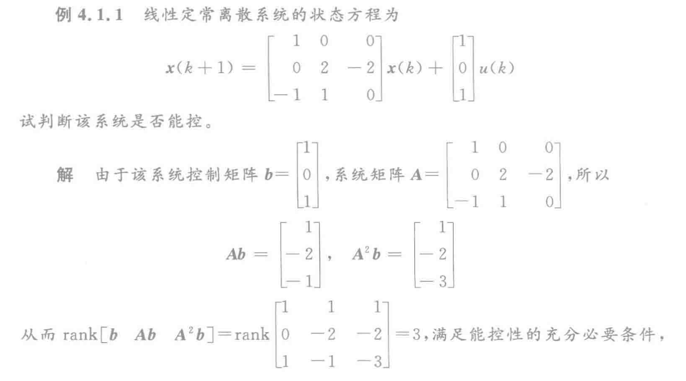
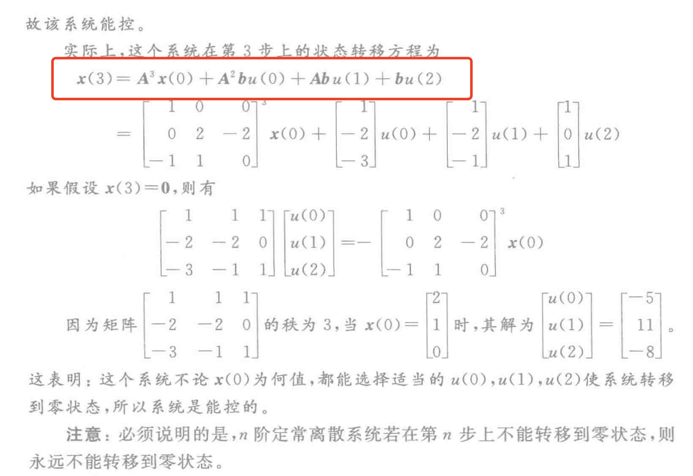
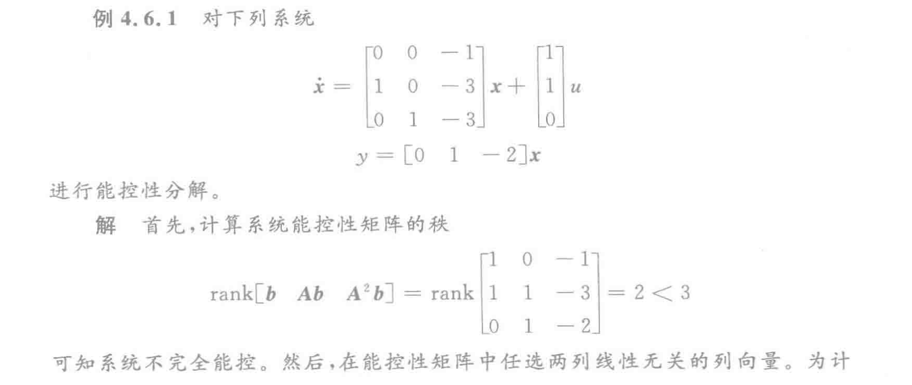
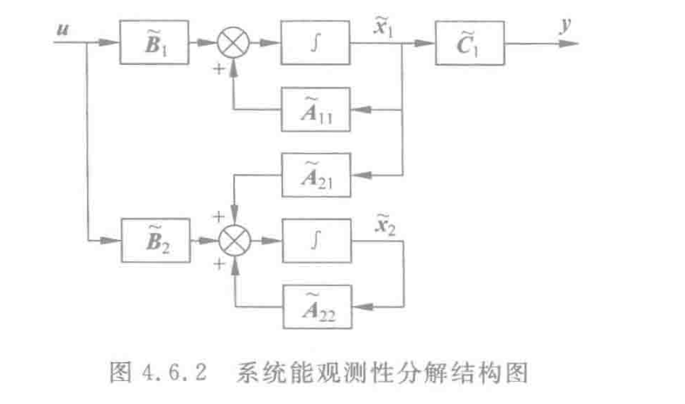
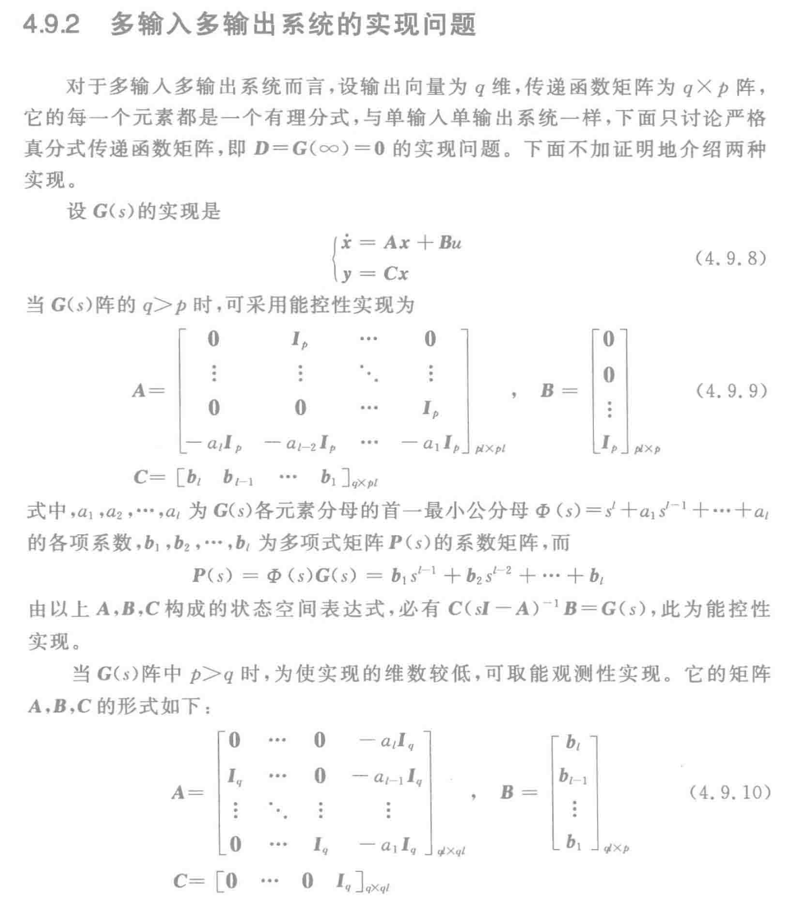

# 4. 第四章

- [4. 第四章](#4-第四章)
  - [4.1 定常离散系统的能控性](#41-定常离散系统的能控性)
    - [4.1.1 定义](#411-定义)
    - [4.1.2 单输入离散系统能控性的判定条件](#412-单输入离散系统能控性的判定条件)
    - [4.1.3 多输入离散系统能控性的判定条件](#413-多输入离散系统能控性的判定条件)
  - [4.2 定常连续系统的能控性](#42-定常连续系统的能控性)
    - [4.2.1 定义](#421-定义)
    - [4.2.2 判断能控性](#422-判断能控性)
    - [4.2.3 线性定常连续系统的输出能控性](#423-线性定常连续系统的输出能控性)
  - [4.3 定常系统的能观测性](#43-定常系统的能观测性)
    - [4.3.1 定常离散系统的能观性](#431-定常离散系统的能观性)
    - [4.3.2 定常连续系统的能观性](#432-定常连续系统的能观性)
  - [4.5 能控性与能观性的对偶关系](#45-能控性与能观性的对偶关系)
  - [4.6 线性定常系统的结构分解](#46-线性定常系统的结构分解)
    - [4.6.1 系统的能控性分解](#461-系统的能控性分解)
    - [4.6.2 系统的能观性分解](#462-系统的能观性分解)
    - [4.6.3 系统按能控性与能观性进行标准分解](#463-系统按能控性与能观性进行标准分解)
  - [4.7 能控性、能观性与传递函数矩阵之间的关系](#47-能控性能观性与传递函数矩阵之间的关系)
    - [4.7.1 单输入单输出系统](#471-单输入单输出系统)
    - [4.7.2 多输入输出系统](#472-多输入输出系统)
  - [4.8 能控标准型和能观标准型](#48-能控标准型和能观标准型)
    - [4.8.1 系统的能控标准型](#481-系统的能控标准型)
    - [4.8.2 系统的能观标准型](#482-系统的能观标准型)
  - [4.9 系统的实现](#49-系统的实现)
    - [4.9.1 单输入单输出系统的实现问题](#491-单输入单输出系统的实现问题)
    - [4.9.2 多输入多输出系统的实现问题](#492-多输入多输出系统的实现问题)
    - [4.9.3 传递函数矩阵的最小实现](#493-传递函数矩阵的最小实现)

## 4.1 定常离散系统的能控性

### 4.1.1 定义

离散系统的状态方程为：
$$
\boldsymbol{x}(k+1)=\boldsymbol{A} \boldsymbol{x}(k)+\boldsymbol{B} \boldsymbol{u}(k)
$$
如果存在控制向量序列 $\boldsymbol{u}(k), \boldsymbol{u}(k+1), \cdots, \boldsymbol{u}(N-1)$ 使系统从第k步的状态向量 $x(k)$ 开始，在第N步达到零状态，即 $x(N)=0$ 其中N事大于k的有限数，那么就称此系统在第k步上事能控的。如果对于每一个k，系统的所有状态都是能控的，**则称系统是状态完全能控的，简称能控。**

### 4.1.2 单输入离散系统能控性的判定条件

结论：

线性定常离散系统（单输入）$\boldsymbol{x}(k+1)=\boldsymbol{A} \boldsymbol{x}(k)+\boldsymbol{b} u(k)$ 完全能控的充分必要条件是矩阵 $\left[\begin{array}{llll}
\boldsymbol{b} \space \boldsymbol{A} \boldsymbol{b} & \cdots & \boldsymbol{A}^{n-1} \boldsymbol{b}
\end{array}\right]$ 的秩为$n$。
$$
\operatorname{rank} \boldsymbol{U}_{\mathrm{c}}=\operatorname{rank}\left[\begin{array}{llll}
\boldsymbol{b} & \boldsymbol{A} \boldsymbol{b} & \cdots & \boldsymbol{A}^{n-1} \boldsymbol{b}
\end{array}\right]=n	
$$

==这个经常用，要注意‼️（这个公式qbb老师在qq上给我讲解了🌍）==
$$
\boldsymbol{x}(3)=\boldsymbol{A}^{3} \boldsymbol{x}(0)+\boldsymbol{A}^{2} \boldsymbol{b} u(0)+\boldsymbol{A} \boldsymbol{b} u(1)+\boldsymbol{b} u(2)
$$
**说明：n阶定常离散系统若在第n步上不能达到零状态，则永远不能转移到零状态。**

### 4.1.3 多输入离散系统能控性的判定条件

判定方法和上面是一样的。

两个特点：

- 多输入系统能控性矩阵$\boldsymbol{U}_{\mathrm{c}}=\left[\begin{array}{llll}
  \boldsymbol{B} & \boldsymbol{A B} & \cdots & \boldsymbol{A}^{n-1} \boldsymbol{B}
  \end{array}\right]$是一个 $n \times np$ 矩阵。根据判据，只要求它的秩等于n，==所以在计算时不一定需要将能控性矩阵算完，发现已经满足n了，就可以停下来了。==
- 为了把系统的某一处是状态转移到零状态，存在着许许多多的方式，因此可以在其中选择最优的控制方式。例如选择控制向量的范数最小。

## 4.2 定常连续系统的能控性

### 4.2.1 定义

$$
\dot{x}=A x+B u
$$

对于系统，若存在一分段连续控制向量  $\boldsymbol{u}(t)$ , 能在有限时间区间  $\left[t_{0}, t_{1}\right]$  内, 将系统从初始状态  $x\left(t_{0}\right)$  转移到任意终端状态 $x\left(t_{1}\right)$ , 那么就称此状态是能控的。若系统任意  $t_{0}$  时刻的所有状态  $\boldsymbol{x}\left(t_{0}\right)$  都是能控的, 就称此系统是状态完全能控的, 简称能控。

### 4.2.2 判断能控性

**第一种方法：**
$$
\boldsymbol{U}_{\mathrm{c}}=\left[\begin{array}{llll}
\boldsymbol{B} & \boldsymbol{A B} & \cdots & \boldsymbol{A}^{n-1} \boldsymbol{B}
\end{array}\right] \\
\operatorname{rank}\left[\begin{array}{llll}
\boldsymbol{B} & \boldsymbol{A B} & \cdots & \boldsymbol{A}^{n-1} \boldsymbol{B}
\end{array}\right]=n
$$
如果系统是单输人系统, 即控制变量维数  $p=1$ , 则系统的状态完全能控性的判据为 $ \operatorname{rank} \boldsymbol{U}_{\mathrm{c}}=\operatorname{rank}\left[\begin{array}{llll}\boldsymbol{b} & \boldsymbol{A} \boldsymbol{b} & \cdots & \boldsymbol{A}^{n-1} \boldsymbol{b}\end{array}\right]=n$  。此时, 能控性矩阵  $\boldsymbol{U}_{\mathrm{c}}$  为  $n \times n$  维,即要求  $\boldsymbol{U}_{\mathrm{c}}$  阵是非奇异（可逆）的。

**第二种方法：**

定理：如果线性定常系统：
$$
\dot{x}=A x+B u
$$
的系统矩阵A具有互不相同的特征值，则系统状态能控的充分条件是，系统经线性非奇异变换后，A矩阵可以变换成对角阵。它的状态方程：
$$
\dot{\hat{x}}=\left[\begin{array}{lll}
\lambda_{1} & & \mathbf{0} \\
& \ddots & \\
\mathbf{0} & & \lambda_{n}
\end{array}\right] \hat{\boldsymbol{x}}+\hat{\boldsymbol{B}} u
$$
==中，$\hat{\boldsymbol{B}}$不包含元素全为0的行。==

如果有重特征值，对应于每一个重特征值只有一个Jordan块，则系统状态完全能控的充要条件是，经线性非奇异变换后，系统化为若尔当标准型：
$$
\dot{\hat{\boldsymbol{x}}}=\left[\begin{array}{cccc}
\boldsymbol{J}_{1} & \mathbf{0} & \cdots & \mathbf{0} \\
\mathbf{0} & \boldsymbol{J}_{2} & \cdots & \mathbf{0} \\
\vdots & \vdots & \ddots & \vdots \\
\mathbf{0} & \mathbf{0} & \cdots & \boldsymbol{J}_{k}
\end{array}\right] \hat{\boldsymbol{x}}+\hat{\boldsymbol{B}} \boldsymbol{u}
$$
式中,  $\hat{\boldsymbol{B}}$  矩阵中与每个若尔当块  $\boldsymbol{J}_{i}(i=1,2, \cdots, k)$  最后一行相对应的那些行, 其各行的元素不全为零。

**特殊情况：**

==如果A为对角但是含有相同的元素（特征值相同但仍能对角化）情况下，或者不同若尔当块中有特征值相同的情况下，直接不能控。==

### 4.2.3 线性定常连续系统的输出能控性

如果在一个有限的区间  $\left[t_{0}, t_{1}\right]$  内, 存在适当的控制向量  $\boldsymbol{u}(t)$ , 使系统能从任意的初始输出  $\boldsymbol{y}\left(t_{0}\right)$  转移到任意指定最终输出  $\boldsymbol{y}\left(t_{1}\right)$ , 则称系统是输出完全能控的。

系统输出完全能控的充分必要条件是矩阵
$$
\left[\begin{array}{lllll}
C B & C A B & CA^{2} B & \cdots & CA^{n-1} B
\end{array}\right]
$$
的秩为  $q$  。

注意两点：

- 状态能控性与输出能控性之间没有必然联系
- 上述判断输出能控性的准则同样适用于离散系统

## 4.3 定常系统的能观测性

能否通过对输出的测量来确定系统的状态变量，这个就是能观性问题。

### 4.3.1 定常离散系统的能观性

$$
\boldsymbol{x}(k+1)=\boldsymbol{A} \boldsymbol{x}(k)+\boldsymbol{B} \boldsymbol{u}(k) \\
\boldsymbol{y}(k)=\boldsymbol{C} \boldsymbol{x}(k)
$$

对于由式所描述的系统, 在已知输人 $\boldsymbol{u}(k)$ 的情况下, 若能依据第 $i$  步及以后  $n-1$  步的输出观测值  $\boldsymbol{y}(i), \boldsymbol{y}(i+1), \cdots, \boldsymbol{y}(i+n-1)$ , 唯一地确定出第  $i$  步上的状态 $x(i)$ , 则称系统在第  $i$  步是能观测的。如果系统在任何  $i$ 步上都是能观测的, 则称系统是状态完全能观测的, 简称能观测。

**判据：**

对于线性定常离散系统：
$$
\begin{array}{c}
\boldsymbol{x}(k+1)=\boldsymbol{A} \boldsymbol{x}(k)+\boldsymbol{B} \boldsymbol{u}(k) \\
\boldsymbol{y}(k)=\boldsymbol{C} \boldsymbol{x}(k)
\end{array}
$$
状态完全能观测的充分必要条件是矩阵：
$$
\left[\begin{array}{c}
\boldsymbol{C} \\
\boldsymbol{C A} \\
\vdots \\
\boldsymbol{C A}^{n-1}
\end{array}\right]
$$
的秩为$n$。该矩阵称为系统的能观测性矩阵，其维数为$nq \times n$ ,以 $U_o$ 表示。

### 4.3.2 定常连续系统的能观性

**第一种方法：**
$$
\left[\begin{array}{c}
\boldsymbol{C} \\
\boldsymbol{C A} \\
\vdots \\
\boldsymbol{C A}^{n-1}
\end{array}\right]
$$
的秩为n。

**第二种方法：**

若线性定常系统的系统矩阵  $\boldsymbol{A}$  有互不相同的特征值, 则系统状态能观测的充要条件是, 经线性等价变换把矩阵化成对角标准形后, 系统的状态空间表达式为：
$$
\dot{\hat{\boldsymbol{x}}}=\left[\begin{array}{llll}
\lambda_{1} & & & 0 \\
& \lambda_{2} & & \\
& & \ddots & \\
\mathbf{0} & & & \lambda_{n}
\end{array}\right] \boldsymbol{x} \\
\boldsymbol{y}=\hat{\boldsymbol{C}} \hat{\boldsymbol{x}}
$$
==式中,矩阵 $\hat{\boldsymbol{C}} $ 不包含元素全为零的列。==

若尔当块的情况也是同理：
$$
\begin{array}{c}
\dot{\hat{x}}=\left[\begin{array}{cccc}
\boldsymbol{J}_{1} & & & \mathbf{0} \\
& \boldsymbol{J}_{2} & & \\
& & \ddots & \\
\mathbf{0} & & & \boldsymbol{J}_{k}
\end{array}\right] \hat{\boldsymbol{x}} \\
\boldsymbol{y}=\hat{\boldsymbol{C}} \hat{\boldsymbol{x}}
\end{array}
$$
==式中, 与每个若尔当块  $\boldsymbol{J}_{i}(i=1,2, \cdots, k)$  **第一列**相对应的  $\hat{\boldsymbol{C}}$  矩阵的所有各列, 其元素不全为零。==

**特殊情况：**

与能控性情况相似，当矩阵A为对角形但含有相同元素时以及当矩阵A的若 尔当标准形中有两个若尔当块的特征值相同，则上述两定理不适用。

## 4.5 能控性与能观性的对偶关系

设系统 $\Sigma_{1}$ 的状态空间方程为：
$$
\begin{array}{l}
\dot{x}=A x+B u \\
y=C x
\end{array}
$$
另有一个系统 $\Sigma_{2}$ 的状态空间表达式为：
$$
\begin{array}{l}
\dot{z}=\boldsymbol{A}^{\mathrm{T}} z+\boldsymbol{C}^{\mathrm{T}} \boldsymbol{v} \\
w=\boldsymbol{B}^{\mathrm{T}} z
\end{array}
$$
==这两个系统中的状态向量  $\boldsymbol{x}$  与  $\boldsymbol{z}$  都是  $n$  维, 控制向量  $\boldsymbol{u}$  与  $\boldsymbol{v}$  分别是  $p$  维与  $q$  维, 输出向量  $\boldsymbol{y}$  与  $w$  分别是  $q$  维与  $p$  维。这两个系统称之为对偶系统。==

此时：

对比上述条件, 清楚地看到系统 $\Sigma_{1}$ 状态完全能控的充要条件和系统  $\Sigma_{2}$  状态完全能观测的充要条件相同; 而 $\Sigma_{1}$  系统状态完全能观测的充要条件则与  $\Sigma_{2}$  系统完全能控的充要条件相同。==如方框图所示，重要方框图‼️==

==**对偶原理：对偶系统的传递函数矩阵是互为转置的。**==

## 4.6 线性定常系统的结构分解

### 4.6.1 系统的能控性分解

$$
\left\{\begin{array}{l}
\dot{x}=A x+B u \\
y=C x
\end{array}\right.
$$

如果一个系统的能控性矩阵rank < n。

定理：存在非奇异矩阵$T_c$，对系统进行状态变换$\boldsymbol{x}=T_{\mathrm{c}} \tilde{x}$，可使 系统的状态空间表达式变换成以下形式：
$$
\left\{\begin{array}{l}
\dot{\dot{x}}=\widetilde{\boldsymbol{A}} \widetilde{\boldsymbol{x}}+\widetilde{\boldsymbol{B}} u \\
y=\widetilde{\boldsymbol{C}} \boldsymbol{x}
\end{array}\right.
$$
其中：
$$
\begin{array}{l}
\widetilde{\boldsymbol{A}}=\boldsymbol{T}_{\mathrm{c}}^{-1} \boldsymbol{A} \boldsymbol{T}_{\mathrm{c}}=\left[\begin{array}{c:c}
\widetilde{\boldsymbol{A}}_{11} & \widetilde{\boldsymbol{A}}_{12} \\
\hdashline \mathbf{0} & \widetilde{\boldsymbol{A}}_{22}
\end{array}\right] \\
\widetilde{\boldsymbol{B}}=\boldsymbol{T}_{\mathrm{c}}^{-1} \boldsymbol{B}=\left[\begin{array}{c}
\widetilde{\boldsymbol{B}}_{1} \\
\hdashline \mathbf{0}
\end{array}\right] \\
\widetilde{\boldsymbol{C}}=\boldsymbol{C T}_{\mathrm{c}}=\left[\begin{array}{l:l}
\widetilde{\boldsymbol{C}}_{1} & \widetilde{\boldsymbol{C}}_{2}
\end{array}\right] \\
\end{array}
$$
==这个变换的公式和第二章的是一样的，记住就行==

$\widetilde{\boldsymbol{A}}_{11}$ 这部分能构成能控的。

==**‼️构造步骤：**==

- 在能控性矩阵 $\boldsymbol{U}_{\mathrm{c}}=\left[\begin{array}{llll}
  \boldsymbol{B} & \boldsymbol{A} \boldsymbol{B} & \cdots & \boldsymbol{A}^{n-1} \boldsymbol{B}
  \end{array}\right]$ 中选择 $n_{1}$ 个线性无关的列向量; 
- 将所得列向量作为矩阵  $\boldsymbol{T}_{\mathrm{c}}$  的前  $n_{1}$  个列, 其余列可以在保证  $\boldsymbol{T}_{\mathrm{c}}$  为非奇异矩阵的条件下任意选择。

**看看例题怎么选就行了：**

**定理：** 能控子系统的传递函数矩阵与原系统的传递函数矩阵相同，即：
$$
\widetilde{\boldsymbol{G}}_{1}(s)=\boldsymbol{G}(s)
$$

### 4.6.2 系统的能观性分解

**定理：**

存在非奇异矩阵 $\boldsymbol{T}_{\mathrm{o}}$ , 用它进行状态变换 $\boldsymbol{x}=\boldsymbol{T}_{\circ} \tilde{\boldsymbol{x}}$ 可使系统状态空间表达式变成：
$$
\left\{\begin{array}{l}
\dot{\dot{\boldsymbol{x}}}=\widetilde{\boldsymbol{A}} \tilde{\boldsymbol{x}}+\widetilde{\boldsymbol{B}} u \\
y=\widetilde{\boldsymbol{C}} \tilde{\boldsymbol{x}}
\end{array}\right.
$$
其中：
$$
\begin{array}{c}
\widetilde{\boldsymbol{A}}=\boldsymbol{T}_{\mathrm{o}}^{-1} \boldsymbol{A} \boldsymbol{T}_{0}=\left[\begin{array}{c:c}
\widetilde{\boldsymbol{A}}_{11} & \mathbf{0} \\
\hline \widetilde{\boldsymbol{A}}_{21} & \widetilde{\boldsymbol{A}}_{22}
\end{array}\right] \\
\widetilde{\boldsymbol{B}}=\boldsymbol{T}_{\circ}^{-1} \boldsymbol{B}=\left[\begin{array}{l}
\widetilde{\boldsymbol{B}}_{1} \\
\hdashline \widetilde{\boldsymbol{B}}_{2}
\end{array}\right] \\
\widetilde{\boldsymbol{C}}=\boldsymbol{C T}_{\mathrm{o}}=\left[\begin{array}{ll}
\widetilde{\boldsymbol{C}}_{1} & \mathbf{0}
\end{array}\right]
\end{array}
$$
**步骤：**

- 从能观测性矩阵 $\boldsymbol{U}_{\mathrm{o}}=\left[\begin{array}{c}
  \boldsymbol{C} \\
  \boldsymbol{C A} \\
  \vdots \\
  \boldsymbol{C A}^{n-1}
  \end{array}\right]$ 中选择 $n_{2}$ 个线性无关的行向量。
- 将所求行向量作为  $\boldsymbol{T}_{0}^{-1}$  的前  $n_{2}$  个行, 其余的行可以在保证  $\boldsymbol{T}_{0}^{-1}$  为非奇异矩阵的条件下任意选择。

==能控是选列，这里是选行‼️==

==重要例题‼️==

**定理：**

能观测子系统的传递函数矩阵与原系统的传递函数矩阵相同，即不能观测状态不会出现在系统传递函数矩阵当中。

### 4.6.3 系统按能控性与能观性进行标准分解

## 4.7 能控性、能观性与传递函数矩阵之间的关系

### 4.7.1 单输入单输出系统

系统的传递函数为：
$$
g(s)=\boldsymbol{c}(s \boldsymbol{I}-\boldsymbol{A})^{-1} \boldsymbol{b}=\boldsymbol{c} \frac{\operatorname{adj}(s \boldsymbol{I}-\boldsymbol{A})}{\Delta(s)} \boldsymbol{b}=\frac{N(s)}{D(s)}
$$
式中,  $N(s)$  为传递函数的分子多项式;  $D(s)$  为传递函数的分母多项式;  $\Delta(s)$  为系统矩阵  $\boldsymbol{A}$  的特征多项式, 它等于  $D(s)$  。如果令  $N(s)=0$  或  $\Delta(s)=0$ , 则求出的  $s$  值分别是传递函数  $g(s)$  的零点和极点。对此, 有如下定理。

==**定理‼️：**系统能控能观的充要条件是传递函数 $g(s)$ 中没有零点极点对消现象。==

==**推论‼️：**==

- ==一个系统的传递函数表示的是该系统既能控又能观的那一部分子系统==
- ==一个系统的传递函数若有零、极对消现象，则视状态变量的选择不同，系统或是不能控的或是不能观的。==

### 4.7.2 多输入输出系统

系统传递函数为：
$$
\boldsymbol{G}(s)=\frac{\boldsymbol{C a d j}(s \boldsymbol{I}-\boldsymbol{A}) \boldsymbol{B}}{\Delta(s)}
$$
式中,  $\Delta(s)=\operatorname{det}(s \boldsymbol{I}-\boldsymbol{A})$ , 即矩阵  $\boldsymbol{A}$  的特征多项式,  $\boldsymbol{G}(s)$  是  $m \times p$  矩阵。对于此系统有如下结论。

结论：

如果传递矩阵  $G(s)$  中,  $\Delta(s)$  与  $\operatorname{Cadj}(s \boldsymbol{I}-\boldsymbol{A}) \boldsymbol{B}$ 之间没有非常数公因式, 则该系统是能控且能观测的。

此定理是多输入多输出系统能控能观测的充分条件而不是必要条件，它的充分性证明和前面定理相仿，不再多述。

## 4.8 能控标准型和能观标准型

### 4.8.1 系统的能控标准型

表示：
$$
\boldsymbol{A}=\left[\begin{array}{ccccc}
0 & 1 & 0 & \cdots & 0 \\
0 & 0 & 1 & \cdots & 0 \\
\vdots & \vdots & \vdots & \ddots & \vdots \\
0 & 0 & 0 & \cdots & 1 \\
-a_{n} & -a_{n-1} & -a_{n-2} & \cdots & -a_{1}
\end{array}\right], \quad \boldsymbol{b}=\left[\begin{array}{c}
0 \\
0 \\
\vdots \\
0 \\
1
\end{array}\right]
$$
如何转换成能控标准型：

存在非奇异变换：
$$
\tilde{x}=P x \text { 或 } \quad x=P^{-1} \tilde{x}
$$
变换后：
$$
\dot{\tilde{\boldsymbol{x}}}=\boldsymbol{A}_{\mathrm{c}} \tilde{\boldsymbol{x}}+\boldsymbol{b}_{\mathrm{c}} u
$$
==**变换矩阵$P$如何确定‼️？**==

直接上公式：
$$
\begin{array}{c}
\boldsymbol{P}=\left[\begin{array}{c}
\boldsymbol{p}_{1} \\
\boldsymbol{p}_{1} \boldsymbol{A} \\
\vdots \\
\boldsymbol{p}_{1} A^{n-1}
\end{array}\right] \\
\boldsymbol{p}_{1}=\left[\begin{array}{llllll}
0 & 0 & 0 & \cdots & 0 & 1
\end{array}\right]\left[\begin{array}{lllll}
\boldsymbol{b} & \boldsymbol{A} \boldsymbol{b} & \boldsymbol{A}^{2} \boldsymbol{b} & \cdots & \boldsymbol{A}^{n-1} \boldsymbol{b}
\end{array}\right]^{-1}
\end{array}
$$

### 4.8.2 系统的能观标准型

$$
\boldsymbol{A}=\left[\begin{array}{ccccc}
0 & 0 & \cdots & 0 & -a_{n} \\
1 & 0 & \cdots & 0 & -a_{n-1} \\
0 & 1 & \cdots & 0 & -a_{n-2} \\
\vdots & \vdots & \ddots & \vdots & \vdots \\
0 & 0 & \cdots & 1 & -a_{1}
\end{array}\right], \quad \boldsymbol{c}=\left[\begin{array}{lllll}
0 & 0 & \cdots & 0 & 1
\end{array}\right]
$$

==变换矩阵T如何确定‼️？==
$$
\begin{array}{l}
\boldsymbol{T}=\left[\begin{array}{llll}
\boldsymbol{T}_{1} & \boldsymbol{A T} & \cdots & \boldsymbol{A}_{1}^{n-1} \\
\boldsymbol{T}_{1}
\end{array}\right] \\
\boldsymbol{T}_{1}=\left[\begin{array}{c}
\boldsymbol{c} \\
\boldsymbol{c A} \\
\vdots \\
\boldsymbol{c A}^{n-1}
\end{array}\right]^{-1}\left[\begin{array}{l}
0 \\
0 \\
\vdots \\
1
\end{array}\right] \\
\end{array}
$$

## 4.9 系统的实现

给定传递函数矩阵，如何求出系统的状态空间表达式？

### 4.9.1 单输入单输出系统的实现问题

在此只讨论严格真分式传递函数的实现问题，即：
$$
g(s)=\frac{\beta_{1} s^{n-1}+\beta_{2} s^{n-2}+\cdots+\beta_{n-1} s+\beta_{n}}{s^{n}+a_{1} s^{n-1}+\cdots+a_{n-1} s+a_{n}}
$$
能控标准型实现：
$$
\begin{array}{l}
\boldsymbol{A}=\left[\begin{array}{ccccc}
0 & 1 & 0 & \cdots & 0 \\
0 & 0 & 1 & \cdots & 0 \\
\vdots & \vdots & \vdots & \ddots & \vdots \\
0 & 0 & 0 & \cdots & 1 \\
-a_{n} & -a_{n-1} & -a_{n-2} & \cdots & -a_{1}
\end{array}\right], \quad \boldsymbol{b}=\left[\begin{array}{c}
0 \\
0 \\
\vdots \\
0 \\
1
\end{array}\right] \\
\boldsymbol{c}=\left[\begin{array}{llll}
\beta_{n} & \beta_{n-1} & \cdots & \beta_{1}
\end{array}\right] \\
\end{array}
$$
能观标准型实现：
$$
\begin{aligned}
\boldsymbol{A} & =\left[\begin{array}{ccccc}
0 & 0 & \cdots & 0 & -a_{n} \\
1 & 0 & \cdots & 0 & -a_{n-1} \\
0 & 1 & \cdots & 0 & -a_{n-2} \\
\vdots & \vdots & \ddots & \vdots & \vdots \\
0 & 0 & \cdots & 1 & -a_{1}
\end{array}\right], \quad \boldsymbol{b}=\left[\begin{array}{c}
\beta_{n} \\
\beta_{n-1} \\
\beta_{n-2} \\
\vdots \\
\beta_{1}
\end{array}\right] \\
\boldsymbol{c} & =\left[\begin{array}{llllll}
0 & 0 & 0 & \cdots & 0 & 1
\end{array}\right]
\end{aligned}
$$
==注意，并不能保证能控或者能观‼️==

当$g(s)$的极点为互不相同的实数或有重实根时，可以将$g(s)$的实现化为对角形或若尔当形，其电路模拟图为并联形式，构成并联实现，这在第2章中已介绍过。

### 4.9.2 多输入多输出系统的实现问题

==行多时用能控，列多时用能观‼️‼️==

### 4.9.3 传递函数矩阵的最小实现

有一种维数最小的实现，称之为传递函数矩阵 $G(s)$ 的最小实现或不可约实现。它时最重要的实现，可以用最少数目的元件（积分器）来模拟系统。

==**定理：传递函数矩阵$G(s)$的最小实现$A$, $B$ , $C$和$D$的充要条件是系统状态完全能控且完全能观测的。‼️**==

==**如何构造最小实现？**==

1. 传递函数矩阵的任何一种能控形或能观测形实现，再检查实现的能观测性或能控性，若已是能控能观测，则必是最小实现。
2. 否则的话，采用结构分解定理，对系统进行能观测性或能控性的分解，找出既能控又能观测的子空间，从而得到最小实现。

