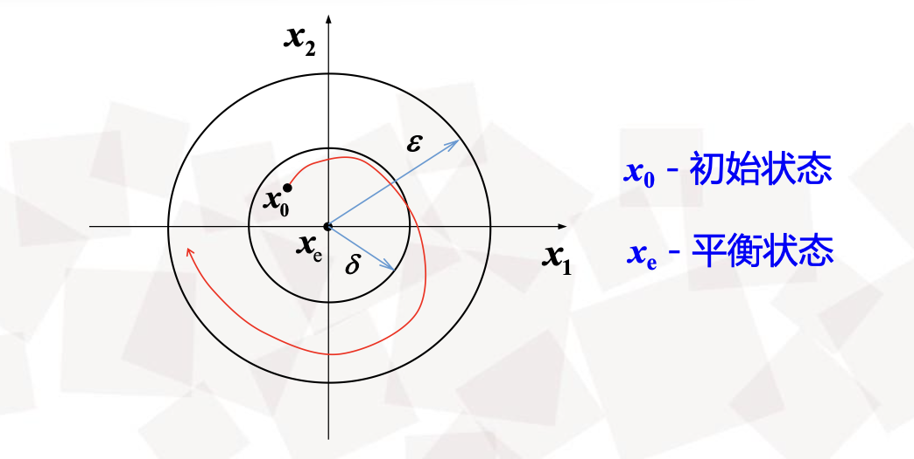
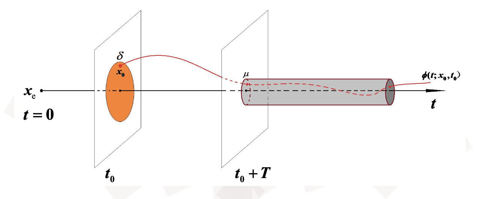
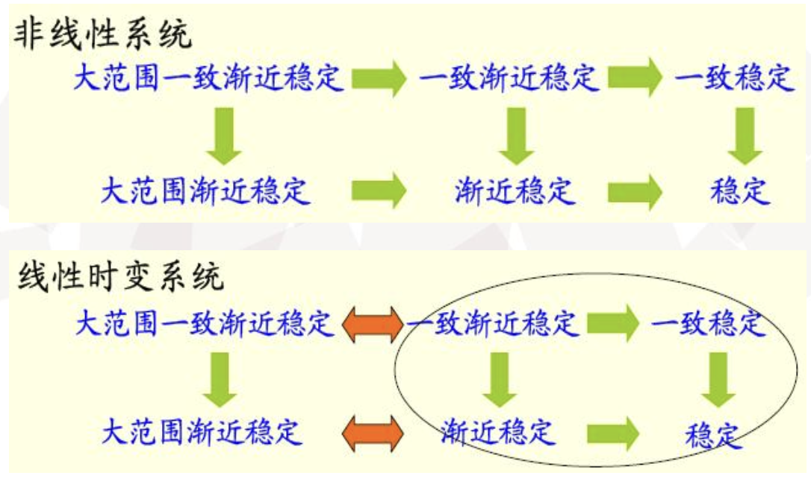
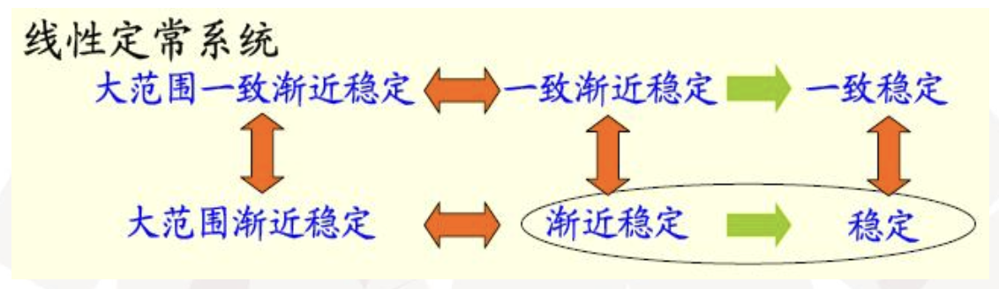
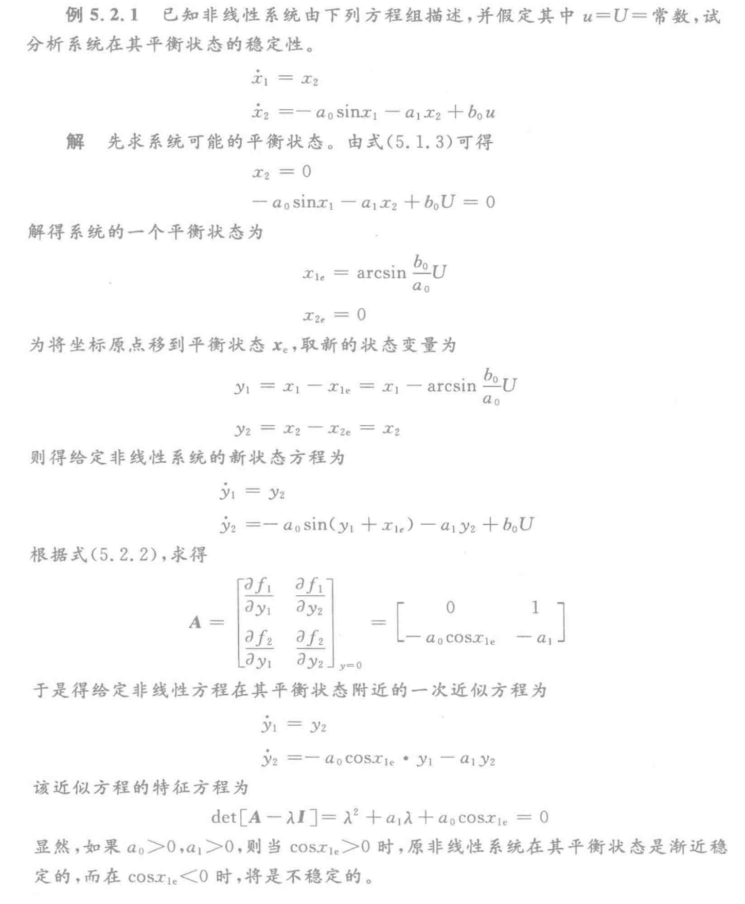
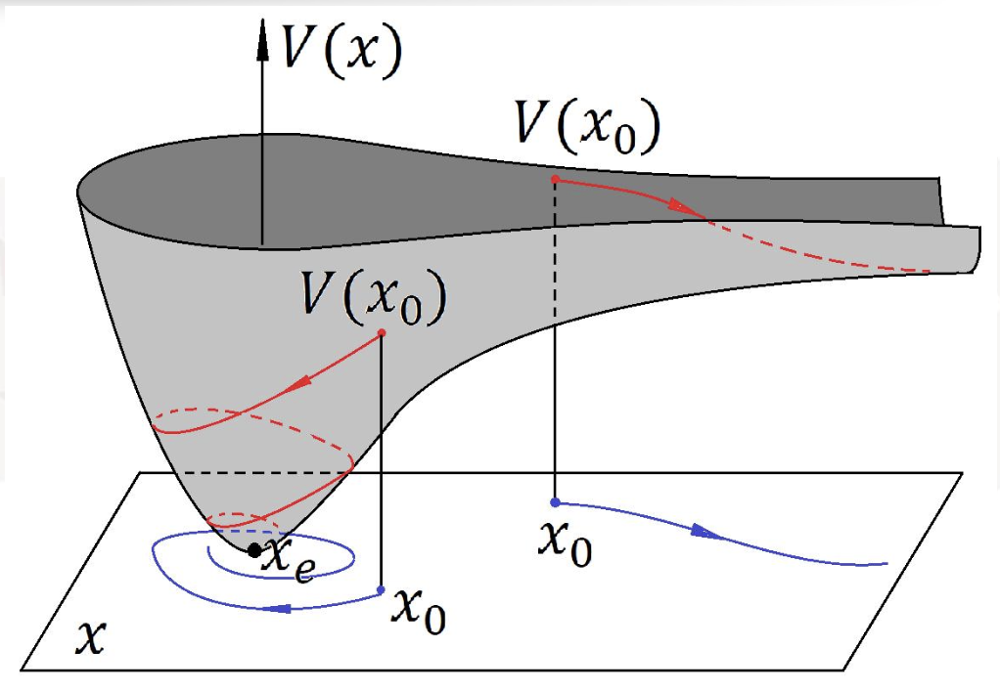
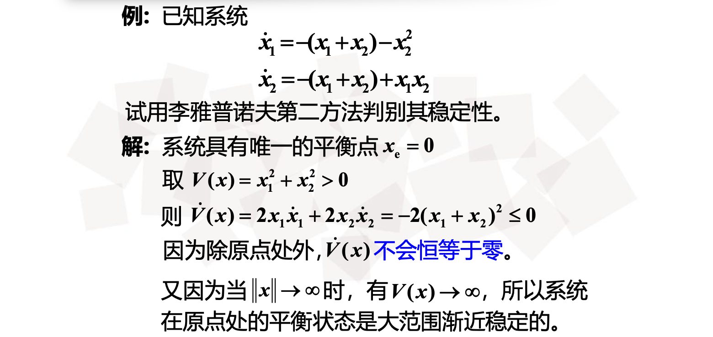
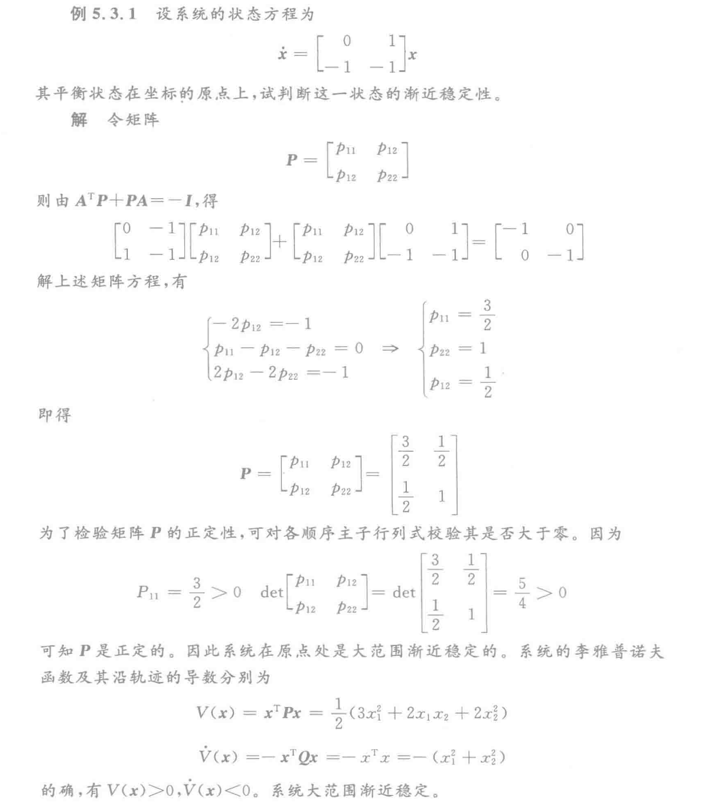

# 5. 第五章

- [5. 第五章](#5-第五章)
  - [5.1 稳定性的基本概念](#51-稳定性的基本概念)
    - [自治系统](#自治系统)
    - [受扰系统](#受扰系统)
    - [平衡状态](#平衡状态)
    - [欧几里德（Euclid）范数](#欧几里德euclid范数)
    - [稳定](#稳定)
    - [一致稳定](#一致稳定)
    - [渐进稳定](#渐进稳定)
    - [一致渐进稳定](#一致渐进稳定)
    - [大范围渐进稳定](#大范围渐进稳定)
    - [不稳定](#不稳定)
    - [几种稳定性之间的关系‼️](#几种稳定性之间的关系️)
    - [正定函数](#正定函数)
    - [二次型](#二次型)
    - [二次型一个重要结论（?）](#二次型一个重要结论)
    - [赛尔维斯特定理](#赛尔维斯特定理)
    - [一个易错概念](#一个易错概念)
    - [5.2 李雅普诺夫稳定性理论](#52-李雅普诺夫稳定性理论)
    - [5.2.1 李雅普诺夫第一方法](#521-李雅普诺夫第一方法)
    - [5.2.2 李雅普诺夫第二方法](#522-李雅普诺夫第二方法)
    - [5.2.3 一些说明](#523-一些说明)
  - [5.3 李雅普诺夫方法在线性系统中的应用](#53-李雅普诺夫方法在线性系统中的应用)
    - [连续系统](#连续系统)
    - [离散系统](#离散系统)

## 5.1 稳定性的基本概念

### 自治系统

零输入作用的系统，用如下方程描述：
$$
\dot{x}=f(x, t) \quad t \geq t_{0} \quad x\left(t_{0}\right)=x_{0}
$$
其中， $x$ 为  $n$ 维状态向量， $f(,,)$ 为 $n$ 维向量函数。如果是定常系统，则没有$t$，如果是线性系统，则$f$函数是$x$的线性函数。

### 受扰系统

**本质：零输入响应**
$$
\boldsymbol{x}(t)=\phi\left(t ; \boldsymbol{x}_{0}, t_{0}\right), \quad t \geqslant t_{0}
$$
它是时间 $t$ 和 $x_{0}$ 、 $t_{0}$ 的函数, 显然有 $\phi\left(t_{0} ; x_{0}, t_{0}\right)=x_{0}$。

### 平衡状态

在(1)描述的系统中，如果对于所有的 $t$ 存在着：
$$
\boldsymbol{f}\left(\boldsymbol{x}_{\mathrm{e}}, t\right)=\mathbf{0}
$$
则称 $x_e$ 为系统的平衡状态，如果系统是线性定常的，则：
$$
\boldsymbol{f}\left(\boldsymbol{x}_{\mathrm{c}}, t\right)=\boldsymbol{A} \boldsymbol{x}
$$

- 当A非奇异，原点是系统唯一的平衡状态
- 当A奇异，则存在无穷多个平衡状态

### 欧几里德（Euclid）范数

即：n维空间中到平衡状态 $x_e$ 的距离，一般来说 $x_e$ 是原点。
$$
\left\|\boldsymbol{x}-\boldsymbol{x}_{\mathrm{e}}\right\|=\left[\left(x_{1}-x_{1 e}\right)^{2}+\left(x_{2}-x_{2 e}\right)^{2}+\cdots+\left(x_{n}-x_{n e}\right)^{2}\right]^{1 / 2} \\
\|x\|=\left[x_{1}^{2}+x_{2}^{2}+\cdots \cdots+x_{n}^{2}\right]^{1 / 2} \quad (x_e 为原点)
$$

### 稳定

对 $\forall \varepsilon>0$ ，若 $\exists\left(\varepsilon, t_{0}\right)>0$ 使得由满足不等式
$$
\left\|\boldsymbol{x}_{0}-\boldsymbol{x}_{\mathrm{e}}\right\| \leqslant \delta\left(\varepsilon, t_{0}\right), \quad t \geqslant t_{0}
$$
的任一初始状态$x_0$出发的受扰运动$x(t)=\phi\left(t ; x_{0}, t_{0}\right)$满足不等式
$$
\left\|\boldsymbol{\phi}\left(t ; \boldsymbol{x}_{0}, t_{0}\right)-\boldsymbol{x}_{\mathrm{e}}\right\| \leqslant \varepsilon, \quad t \geqslant t_{0}
$$
==则称 $x_{\mathrm{e}}$ 存李雅普诺夫意义下是稳定的。==

其实可以这样理解：

里面的小圆是 $\delta$ , 大圆是 $\varepsilon$, 只要出发点在小圆内的曲线，都不会跑到大圆外去，则稳定。

一般来说，小圆的大小是根据大圆大小和 $t_0$ 共同决定的。

### 一致稳定

如果  $\delta$  只依赖于 $\varepsilon$ 而和  $t_{0}$  的选取无关，则称平衡状态  $x_{e}$  是一致稳定的。

==**对于定常系统，稳定和一致稳定是等价的‼️。**==

通常要求系统是一致稳定的，以便在任意初始时刻 $t_0$ 出现的受扰运动都是李雅普诺夫意义下稳定的。

### 渐进稳定

如果 $x_e$ 是李雅普诺夫意义**稳定的**，且具有**吸引性**。（注意：前提是稳定）

即：对于  $\delta\left(\varepsilon, t_{0}\right)$  和  $\forall \mu>0$  ，总  $\exists T\left(\mu, \delta, t_{0}\right)>0$ 使得由满足不等式  $\left\|x_{0}-x_{\mathrm{e}}\right\| \leq \delta\left(\varepsilon, t_{0}\right), t \geq t_{0}$ 的任一初态  $x_{0}$  出发的受扰运动都满足不等式：
$$
\left\|\phi\left(t ; x_{0}, t_{0}\right)-x_{\mathrm{e}}\right\| \leq \mu, \quad \forall t \geq t_{0}+T\left(\mu, \delta, t_{0}\right)
$$
则称平衡状态 $x_{e}$ 是渐近稳定的。

随着  $\boldsymbol{\mu} \rightarrow 0$  ，显然有  $T \rightarrow \infty$  ，因此原点的平衡状态  $x_{\mathrm{e}}$  为渐近稳定时，必成立：
$$
\lim _{t \rightarrow \infty} \phi\left(t ; x_{0}, t_{0}\right)=x_{\mathrm{e}}, \quad \forall x_{0} \in S(\delta) \\
S(\delta) 是超球域
$$
==既反映了运动的有界性，同时又反映了运动随时间变化过程的渐进性。==

==**因此：渐进稳定=稳定+吸引**==

### 一致渐进稳定

如果实数  $\boldsymbol{\delta}$  和  $\boldsymbol{T}$  的大小都不依赖于初始时刻  $t_{0}$  ，则称平衡状态  $x_{\mathrm{e}}$  是一致渐近稳定的。
$$
\delta\left(\varepsilon, t_{0}\right)=\delta(\varepsilon) \\
T\left(\mu, \delta, t_{0}\right)=T(\mu, \delta)
$$
==对于定常系统，渐进稳定和一致渐进稳定是等价的。==

==**反正渐进的意思就是，和 $t_0$ 无关‼️**==

### 大范围渐进稳定

如果从状态空间的任一有限非零初始状态  $x_{0}$  出发的受扰运动  $\phi\left(t ; x_{0}, t_{0}\right) $ 都是有界的，且满足在：
$$
t \rightarrow \infty 时, \quad \phi\left(t ; x_{0}, t_{0}\right) \rightarrow 0
$$
另一种说法: 如果  $x_{\mathrm{e}}=0$  是稳定的平衡状态，且当  $t \rightarrow \infty$  时，系统的每个解都收玫于  $x_{\mathrm{e}}=0$  ，则此平衡状态就是大范围渐近稳定的。

==**显然，大范围渐近稳定的必要条件是在整个状态空间中只有一个平衡状态。**==

==**对于线性系统，若其平衡状态为渐近稳定，则必然是大范围渐近稳定。**==

> 不言而喻，我们总是系统系统具有大范围渐进稳定性。
>
> 如果不是这样，我们就需要确定渐进稳定的引力域，而这项工作是困难的。
>
> 但是对于实际问题来说，确定一个足够大的渐进稳定范围，使得厨师扰动不超过它也就足够了。

### 不稳定

对于某个实数 $\varepsilon>0$  和  $\forall \delta>0$  ，在超球域  $S(\delta)$  内始终存在状态  $x_{0}$  ，使得从该状态开始的受扰运动至少有一条状态轨线要越过超球域  $S(\varepsilon)$  。

### 几种稳定性之间的关系‼️

### 正定函数

令 $V(x)$ 是向量 $x$ 的标量函数，$S$ 是 $x$ 空间包含原点的封闭有限区域。如果对于 $S$ 中的所有 $x$，都有下面三个条件，则称 $V(x)$ 是正定的（半正定的）。

- $\frac{\partial}{\partial x} V(x)$ 存在且连续，即存在各个分量的连续偏导数。
-  $V(0) = 0$ 
- 当 $x \neq 0$ 时， $V(x) > 0 \space (V(x) \ge 0)$

如果条件3中符号反向，则称 $V(x)$ 为负定或者半负定的。

如果在 $S$ 域内，无论 $S$ 多小，$V(x)$ 可能是正的也可能是负的，则是不定的。

### 二次型

建立在李雅普诺夫第二方法上的稳定性分析中，有一类标量函数起着重要的作用，即为二次型函数：
$$
V(x)=x^{\mathrm{T}} P x
$$
P 为权矩阵，一般有：
$$
P=\left[\begin{array}{cccc}
p_{11} & p_{12} & \cdots & p_{1 n} \\
p_{21} & p_{22} & \cdots & p_{2 n} \\
\vdots & \vdots & \ddots & \vdots \\
p_{n 1} & p_{n 2} & \cdots & p_{n n}
\end{array}\right] \quad \begin{array}{l} \\
\end{array}
\\
V(x)=\sum_{i=1}^{n} \sum_{j=1}^{n} p_{i j} x_{i} x_{j}
$$
常取 $P$ 为对称矩阵，即 $p_{ij} = p_{ji}$。

### 二次型一个重要结论（?）

对于二次型：
$$
f(x, y, z) = ax^2 + by^2 + cz^2 + dxy + exz + fyz
$$
==则 $P$：==
$$
P = \begin{pmatrix}
 a & d/2 & e/2 \\
 d/2 & b & f/2 \\
 e/2 & f/2 & c
\end{pmatrix}
$$

### 赛尔维斯特定理

==**当 $P$ 为对称矩阵的时候，$V(x)$ 为正定的充分必要条件是 $P$ 的所有顺序主子行列式都是正的‼️，即：**==
$$
p_{11}>0, \quad \operatorname{det}\left[\begin{array}{ll}
p_{11} & p_{12} \\
p_{21} & p_{22}
\end{array}\right]>0, \quad \cdots, \quad \operatorname{det} P>0
$$
如果 $P$ 的所有主子行列式为非负的，且至少一个等于零，那么 $V(x)$ 即是**半**正定的。

如果 $-V(x)$  是正定的（半正定的），则$V(x)$将是负定的（半负定的）。

### 一个易错概念

==**矩阵(半)负定当且仅当所有顺序主子行列式都是负的(非正的)，这个是错的‼️**==

**矩阵（半）负定当且仅当：**

- 奇数阶顺序主子式为负（非正）
- 偶数阶顺序主子式为正（非负）

### 5.2 李雅普诺夫稳定性理论

### 5.2.1 李雅普诺夫第一方法

李雅普诺夫第一方法又称为间接法，其基本思想是解出系统的状态方程，然后根据状态方程解的性质判别系统的稳定性。

- 对于线性系统，只须求出系数矩阵的特征值即可判断其稳定性。
- 对于非线性系统，则可以通过线性化处理，得到一次近似的线性化方程，然后再来判断
- 若系统存在一个以上的平衡状态，则要对每个平衡状态进行研究。

显然，对于线性系统，只需要求出系数矩阵的特征值就能判断其稳定性。

考察非线性系统，设在零输入下状态方程为：
$$
\dot{x}=f(x)
$$
讨论系统在其平衡状态  $x_{\mathrm{e}}$  的稳定性，将非线性向量函数  $f(x)$  在平衡状态  $x_{\mathrm{e}}$  拊近展开成泰勒级数：
$$
\dot{x}=\left.\frac{\partial f}{\partial x}\right|_{x=x_{\mathrm{e}}}\left(x-x_{\mathrm{e}}\right)+O\left(\left(x-x_{\mathrm{e}}\right)^{2}\right) \quad f\left(x_{\mathrm{e}}\right)=0
$$
$O(...)$ 是高阶项。

引入新的向量 $y=x-x_{e}$ 将平衡状态移到原点，得：
$$
\dot{\boldsymbol{y}}=A y+O\left(y^{2}\right) \quad A=\left.\frac{\partial f}{\partial x}\right|_{x=x_{0}}=\left.\frac{\partial f}{\partial y}\right|_{y=0}
$$
从而得到一次近似的线性化方程：
$$
\dot{y} = Ay
$$
其中 $A$ 为 $n \times n$ 的雅各比矩阵（Jacobian），即：
$$
A=\left[\begin{array}{ccc}
\frac{\partial f_{1}}{\partial y_{1}} & \cdots & \frac{\partial f_{1}}{\partial y_{n}} \\
\vdots & \cdots & \vdots \\
\frac{\partial f_{n}}{\partial y_{1}} & \cdots & \frac{\partial f_{n}}{\partial y_{n}}
\end{array}\right]_{y=0}=\left[\begin{array}{ccc}
\frac{\partial f_{1}}{\partial x_{1}} & \cdots & \frac{\partial f_{1}}{\partial x_{n}} \\
\vdots & \cdots & \vdots \\
\frac{\partial f_{n}}{\partial x_{1}} & \cdots & \frac{\partial f_{n}}{\partial x_{n}}
\end{array}\right]_{x=x_{c}}
$$
出现在雅可比矩阵  $A$  中的所有偏导数都是在平衡状态  $x=x_{\mathrm{e}}$  或 $y=0$  处求取的。  $O\left(y^{2}\right)$ 是由泰勒级数展开式的高阶导数项所组成，其元素在平衡状态为0。

==**结论‼️：**==

- 如果  $\operatorname{Re}\left(\lambda_{i}(A)\right)<0$  ，即  $A$  的所有特征值都具有负实部，则原非线性系统的平衡状态  $x_{\mathrm{e}}$  是渐近稳定的，且系统的稳定性与高阶导数项无关。==注意，是要求矩阵 $A$ 的特征值，不是看矩阵 $A$ 本身。==
- 如果  $A$  的特征值中至少有一个实部为正，则原非线性系统的平衡状态  $x_{\mathrm{e}}$  是不稳定的。
- 如果  $A$  的特征值中，虽然没有实部为正的，但有为零的，则原非线性系统的平衡状态  $x_{\mathrm{e}}$  的稳定性要由高阶导数项来决定。

==**重要例题：**==

### 5.2.2 李雅普诺夫第二方法

**能量函数的概念：**

- 李雅普诺夫稳定性理论建立了系统能量与稳定性之间的关系。

- 如果系统有一个渐近稳定的平衡状态，则当它转移到该平衡状态的邻域内时，系统所具有的能量随着时间的增加而逐渐减少，直到在平衡状态达到最小值。需要有一个抽象的能量函数来描述系统的虚拟能量。

- 能量函数：状态和时间的标量函数

- 此能量函数称为李雅普诺夫函数，记作 $V(x, t)$。

通过分析系统能量的变化来确定系统运动的稳定性对一个给定的系统，如果能够找到一个正定的标量函数，它沿着轨迹对时间的导数总是负值，则随着时间的增加，$V(x)$将取越来越小的值，随时间的进步增加，最终将导致$V(x)$变为零，$x$也变为零。这意味着状态空间的原点是渐近稳定的。

==**定理：**==

假设系统的状态方程为：
$$
\dot{\boldsymbol{x}}=\boldsymbol{f}(\boldsymbol{x}, t), \quad \boldsymbol{f}(\mathbf{0}, t)=\mathbf{0}, \quad \forall t
$$
如果存在一个具有连续偏导数的标量函数（李雅普诺夫函数）$V(x, t)$，并且满足条件：

- $V(x, t)$是正定的
- $\dot{V}(x, t)$是负定的

那么系统在原点处的平衡状态时**一致渐进稳定**的。如果随着 $\|x\| \rightarrow \infty$，有 $V(x, t) \rightarrow \infty$（径向无界）则在原点处的平衡状态是**大范围渐进稳定**的。

比如：

注意：如果只能找到 $V(x)$ 符合下面这个条件：

- $V(x, t)$ 是正定的
- $\dot{V}(x, t) \le 0$ 

也就是第二个条件还不够符合，==则只能得出稳定的结论，不能得出渐进稳定的结论。==

**这个时候运动轨迹将落在某个特定的曲面上，而不会收敛于原点，属于临界稳定。**

比如：

==**补充定理：**==

对于系统：
$$
\dot{x}=f(x, t), \quad f(0, t)=0 \quad \forall t
$$
如果存在一个标量函数 $V(x, t)$ 并且满足条件：

- $V(x, t)$是正定的
- $\dot{V}(x, t)$ 是==**半负定**==的
- $\dot{V}\left(\phi\left(t ; x_{0}, t_{0}\right), t\right)$ 对任意的 $t_{0}$ 和任意的  $x_{0} \neq 0$

在 $t \ge t_0$ 时不恒等于0，那么系统是**一致渐进稳定**的。如果随着 $\|x\| \rightarrow \infty$，有 $V(x, t) \rightarrow \infty$（径向无界）则在原点处的平衡状态是**大范围渐进稳定**的。

==**定理：**==

对于系统：
$$
\dot{x}=f(x, t), \quad f(0, t)=0 \quad \forall t
$$
如果存在一个标量函数 $V(x, t)$ 并且满足条件：

- $V(x, t)$ 是正定的
- $\dot{V}(x, t)$ 是**半负定**的

则系统在原点处的平衡状态时一致稳定的。

**需要注意：**

- $\dot{V}(x, t)$ 的半负定表示原点是一致稳定的，但未必是致渐近稳定的。在这种情况下系统可能呈现极限环运行状态。

- 如果系统的平衡状态 $x=0$ 是不稳定的，那么就存在一个标量函数 $W(x, t)$，并可以用 $W(x, t)$ 来确定平衡状态的不稳定性。

==**定理：**==

对于系统：
$$
\dot{x}=f(x, t), \quad f(0, t)=0 \quad \forall t
$$
如果存在一个标量函数 $W(x,t)$，它具有连续的一阶偏导数，并且满足条件：

- $W(x, t)$ 在原点的某一邻域内是正定的
- $\dot{W}(x, t)$ 在同样的邻域中是正定的

则系统在原点出的平衡状态是不稳定的。

比如：

### 5.2.3 一些说明

1. 对于一个给定的系统，李雅普诺夫函数不是唯一的。
2. 对于非线性系统能给出关于在大范围内稳定性的信息。
3. 若系统稳定，则一定存在满足条件的李雅普诺夫函数，但是从特定李雅普诺夫函数得到的稳定性条件是充分的而不是必要的。
4. 因此，若没能找到合适的李雅普诺夫函数就不能得出该系统稳定性方面的任何结论。
5. 李雅普诺夫函数只能判断其定义域内平衡状态的稳定性。
6. 如果系统的原点是稳定的或渐近稳定的，那么具有所要求性质的李雅普诺夫函数一定是存在的。经验表明，李雅普诺夫函数最简单的形式是二次型，即 $V(x) = x^TPx$，$P$ 为正定的实对称方阵。

## 5.3 李雅普诺夫方法在线性系统中的应用

**利用李雅普诺夫方法判断线性系统的稳定性**

### 连续系统

==**定理：**==

==**问题其实就是如何通过 $A$ 找到 $V(x)$‼️**==

设系统的状态方程为：
$$
\dot{x} = Ax
$$
$A$ 为 $n \times n$ 常数非奇异矩阵。则系统在平衡状态 $x=0$ 处是大范围渐进稳定的充要条件是：给定一个正定的实对称矩阵 $Q$，存在一个正定的实对称矩阵 $P$，满足李雅普诺夫（矩阵代数）方程：
$$
A^TP + PA = -Q
$$
此时的标量函数 $V(x) = x^TPx$ 就是系统的李雅普诺夫函数。

注意：

- 如果$V(x)=-x^TQx$沿任意一条轨迹都不恒等于零，那么 $Q$ 可取为半正定的。
- 如果取一个任意的正定矩阵（或者，若  $\dot{V}(x)$  沿一轨迹不恒等于零时，取为半正定矩阵)，并求解矩阵方程式以确定 $P$  ，则对于系统在  $x=0$  的平衡状态是渐近稳定的来说，  $P$ 为正定是个充要条件。分析过程：先确定  $Q$  ，再由方程计算 $P$  ，判断  $P$  的正定性。
- 为了确定 $P$ 的各元素，可以使用矩阵 $A^TP+PA$ 和矩阵 $-Q$ 的各元素相等，这就导致了有 $n(n+1)/2$ 个线性代数方程。如果用 $\lambda_1, \lambda_2, ... \lambda_n$ 表示矩阵 $A$ 的特征值，当它们两两不相等，且每两者和有 $\lambda_i + \lambda_j \neq 0, \forall i, j$ 的时候，矩阵 $P$ 的元素是唯一确定的。实际上，如果矩阵 $A$ 表示一个稳定系统，那么  $\lambda_i + \lambda_j$ 总是不等于0的。
- ==只要矩阵 $Q$ 选成正定的（或在许可时选为半正定的），那么对于系统渐进稳定的最终结果与 $Q$ 的具体选取无关。因此，在确定是否存在一个正定的实对称矩阵 $P$ 时，可简单地选取 $Q = I$，$I$ 为n维单位矩阵。即根据 $A^TP+PA = -I$ 来求 $P$，然后检验 $P$ 是否是正定的。==

**重要例题：**

### 离散系统

直接看公式就行了：
$$
Q = -(G^TPG-P)
$$
是正定的就行了。

