# 6. 第六章

- [6. 第六章](#6-第六章)
  - [6.1 状态反馈的定义及其性质](#61-状态反馈的定义及其性质)
    - [6.1.1 状态反馈的构造](#611-状态反馈的构造)
    - [6.1.2 状态反馈的性质](#612-状态反馈的性质)
    - [6.1.3 相关定理](#613-相关定理)
  - [6.2 极点配置](#62-极点配置)
    - [6.2.1 极点配置定理](#621-极点配置定理)
    - [6.2.2 单输入系统极点配置的算法](#622-单输入系统极点配置的算法)
      - [第一种算法](#第一种算法)
      - [第二种算法](#第二种算法)
    - [6.2.3 关于一些细节和本质的讨论](#623-关于一些细节和本质的讨论)
  - [6.4 状态观测器](#64-状态观测器)
    - [6.4.0 基本概念](#640-基本概念)
    - [6.4.1 状态观测器的存在条件](#641-状态观测器的存在条件)
    - [6.4.2 全维状态观测器](#642-全维状态观测器)
      - [开环状态估计器](#开环状态估计器)
      - [闭环状态估计器](#闭环状态估计器)
    - [6.4.3 降维状态观测器](#643-降维状态观测器)
  - [6.5 带状态观测器的反馈系统](#65-带状态观测器的反馈系统)

## 6.1 状态反馈的定义及其性质

### 6.1.1 状态反馈的构造

给定系统的状态空间表达式：
$$
\sum:\left\{\begin{array}{l}
\dot{x}=A x+B u \\
y=C x+D u
\end{array}\right.
$$
在系统中引入反馈控制率，即状态反馈：
$$
u=L v-K x
$$
其中 $v$ 为 $p$ 维控制输入向量，$K$ 为 $p \times n$ 的状态反馈增益矩阵，$L$ 为 $p \times p$维非奇异实常数矩阵，称为输入变换矩阵。

反馈后的闭环系统结构如下所示：

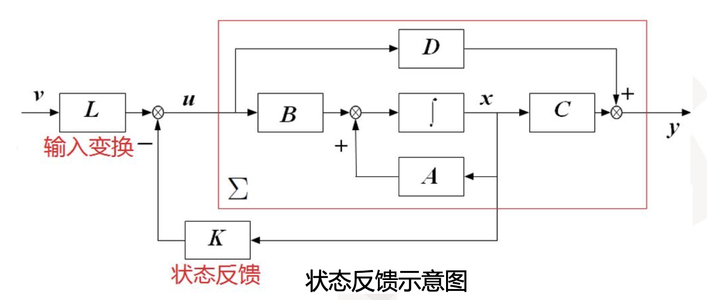

闭环后的状态空间表达式为：
$$
\Sigma_{K}:\left\{\begin{array}{l}
\dot{x}=(A-B K) x+B L v \\
y=(C-D K) x+D L v
\end{array}\right.
$$
如果 $D = 0$ 则：
$$
\Sigma_{K}:\left\{\begin{array}{l}
\dot{x}=(A-B K) x+B L v \\
y=C x
\end{array}\right.
$$

### 6.1.2 状态反馈的性质

1. 当 $L=I$ 的时候，即对输入不做变换时，为单纯的状态变量反馈，==若$K = HC$，则 $Kx = Hy$，状态反馈就等价于输出反馈，因此，输出反馈是状态反馈的特殊情况。==
2. ==$D = 0$ 的时候，闭环系统的传递函数矩阵为 $G(s ; K, L)=C[s I-(A-B K)]^{-1} B L$。==
3. ==闭环传递函数还有另一种形式：$\boldsymbol{G}(s ; \boldsymbol{K}, \boldsymbol{L})=\boldsymbol{G}(s)\left[\boldsymbol{I}+\boldsymbol{K}(s \boldsymbol{I}-\boldsymbol{A})^{-1} \boldsymbol{B}\right]^{-1} \boldsymbol{L}$==

从传递特性来看，状态反馈 $\{K, L\}$ 所造成的影响相当于在原系统的前面另串联一个系统，如图所示。

### 6.1.3 相关定理

引入状态反馈控制率 $\{K, I\}$ 对能控性和能观性的影响。

==**定理：对于任何实常量矩阵 $K$，闭环系统 $\boldsymbol{\Sigma}_{\boldsymbol{K}}$ 状态完全能控的充要条件是原系统 $\boldsymbol{\Sigma}$ 状态完全能控。即引入状态反馈 $\{K, I\}$ 不影响系统能控性，但是可能影响系统的能观性‼️**==

事实上 $L$ 只要是任意的非奇异常量矩阵时，状态反馈控制率 $\{K, L\}$ 都不影响系统的能控性。

## 6.2 极点配置

### 6.2.1 极点配置定理

**定理：**给定系统 $\Sigma$ 的状态空间表达式为：
$$
\sum:\left\{\begin{array}{l}
\dot{x}=A x+B u \\
y=C x+D u
\end{array}\right.
$$
通过状态反馈 $u = v- Kx$

**能使其闭环极点位于预先任意指定位置上的充要条件是 $\Sigma$ 完全能控。**

### 6.2.2 单输入系统极点配置的算法

#### 第一种算法

**‼️步骤：**

1. 求 $A$ 的特征多项式
   $$
   \alpha(s)=\operatorname{det}(s \boldsymbol{I}-\boldsymbol{A})=s^{n}+a_{1} s^{n-1}+\cdots+a_{n-1} s+a_{n}
   $$

2. 求闭环系统的期望特征多项式
   $$
   \alpha^{*}(s)=\left(s-\lambda_{i}^{*}\right)\left(s-\lambda_{2}^{*}\right) \cdots\left(s-\lambda_{n}^{*}\right)=s^{n}+a_{1}^{*} s^{n-1}+\cdots+a_{n-1}^{*} s+a_{n}^{*}
   $$

3. 计算
   $$
   \widetilde{\boldsymbol{K}}=\left[\begin{array}{ll}
   a_{n}^{*}-a_{n} & a_{n-1}^{*}-a_{n-1} \cdots a_{1}^{*}-a_{1}
   \end{array}\right]
   $$

4. 计算
   $$
   \boldsymbol{Q}=\left[\begin{array}{llll}
   \boldsymbol{b} & \boldsymbol{A} \boldsymbol{b} & \cdots & \boldsymbol{A}^{n-1} \boldsymbol{b}
   \end{array}\right] \cdot\left[\begin{array}{cccc}
   a_{n-1} & \cdots & a_{1} & 1 \\
   \vdots & . & . & \\
   a_{1} & & \mathbf{0} & \\
   1 & & &
   \end{array}\right]
   $$

5. 令 $P=Q^{-1}$
6. 求 $K = \widetilde{K}P$

**‼️重要例题：**

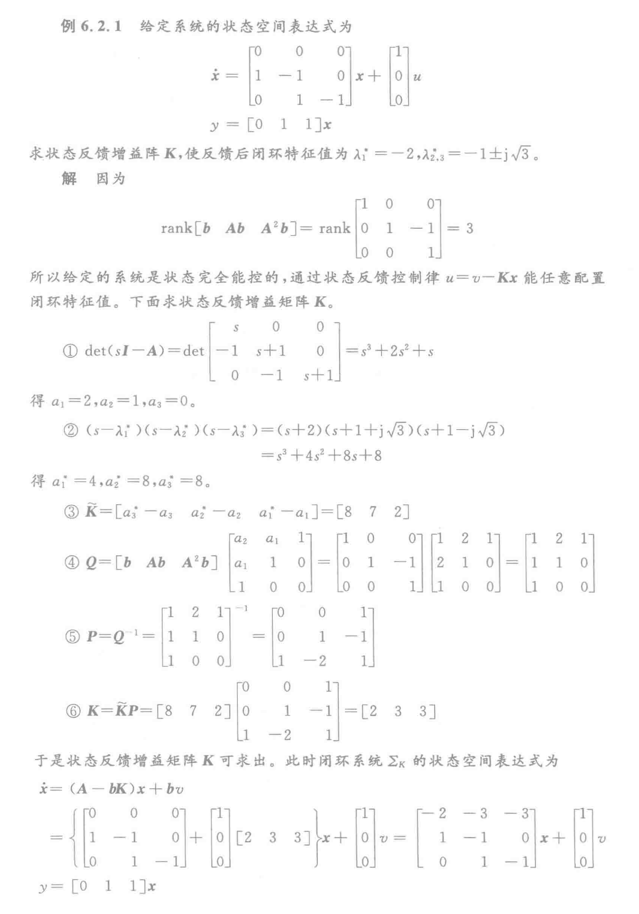

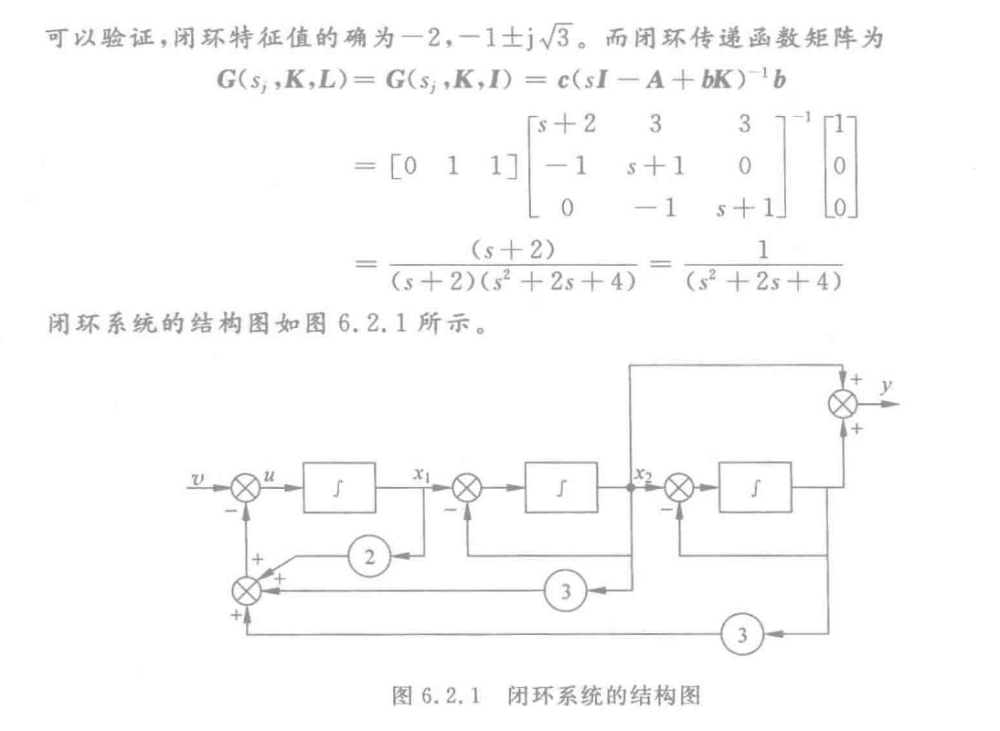

==**这个图先用开环的 $A$ 先画出开环的部分，然后对应求出来的 $K$ 对每一个状态变量做反馈，加到 $u$ 上去即可‼️**==

#### 第二种算法

**‼️步骤：**

1. 将 $u = -Kx$ 带入系统状态方程，并求得响应闭环系统的特征多项式
   $$
   \alpha(s)=s^{n}+a_{1}(\boldsymbol{K}) s^{n-1}+\cdots+a_{n-1}(\boldsymbol{K}) s+a_{n}(\mathbf{K})
   $$
   式中, $a_i(K)$ 是反馈矩阵 $K$ 的系数，$i=1, 2, 3, ..., n$。

2. 计算理想特征多项式
   $$
   \begin{aligned}
   \alpha^{*}(x) & =\left(s-\lambda_{1}^{*}\right)\left(s-\lambda_{2}^{*}\right) \cdots\left(s-\lambda_{n}^{*}\right) \\
   & =s^{n}+a_{1}^{*} s^{n-1}+\cdots+a_{n-1}^{*} s+a_{n}^{*}
   \end{aligned}
   $$

3. 列方程组 $a_i(K) = a_i^{*}, i=1, 2, 3, ..., n$ 并求解。其中解 $ K = [k_1, k_2, ..., k_n]$ 即为所求。该算法适用于系统维数比较低，控制矩阵中只有一个非零元素的情况。当矩阵 $b$ 中非零元素个数大于等于2的时候，方程组 $a_i(K) = a_i^*, i=1, 2, 3, ..., n$ 中未知数的次数可能会大于等于2，而导致求解困难。

**‼️重要例题：**

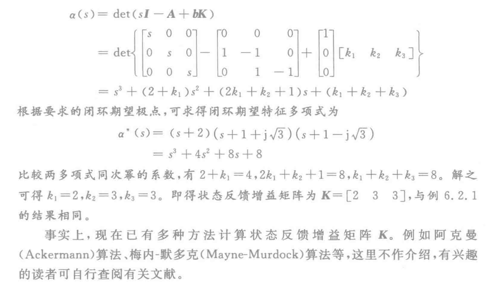

注意：经过状态反馈 $u=v-Kx$ 后，闭环系统的特征多项式为：
$$
a(s) = \operatorname{det}(sI-A+bK)
$$

### 6.2.3 关于一些细节和本质的讨论

**（1）状态反馈不会改变系统的维数。但是闭环传递函数的阶次可能会降低，因为闭环之后可能会分子分母对消。**

**（2）对于单输入单输出系统，状态反馈不会移动系统传递函数的零点。**

**（3）所以1-2可以很好解释为什么状态反馈可能会改变系统的能观性，因为可能出现对消情况，对消之后系统能控，所以此时一定不能观。**

（4）当且仅当 $\{A, b\}$ 完全能控时，$(A-bK)$ 的所有特征值才能配置在任意指定的位置。

（5）在系统综合中，往往需要移动不稳定的极点，就是把那些虚轴右边的极点移动到左边去，这一过程叫做系统镇定（其实就是校正）。那么在一些不完全能控的系统中，判断系统能否被镇定，就要看看不能控的那部分特征值是不是已经在系统左边了。如果不能控的部分特征值是没问题的（在左边），那么系统也可以被镇定。但是只要存在不能控的部分的特征值不符合要求（在右边）系统就不能被镇定。==**我能管的，你一开始不符合要求也没事，我也能控制，我管不了的（不能控部分），一开始如果不符合要求，那就没办法了。‼️**==

## 6.4 状态观测器

### 6.4.0 基本概念

1. 利用状态反馈能够任意配置一个能控系统的闭环极点，从而有效改善控制系统的性能
2. 在实际中，常常无法直接获得系统的全部状态变量，从而使得状态反馈的物理实现遇到困难。
3. 克服这种困难的途径之一是重构系统的状态并利用重构的状态代替系统的真实状态实现所需的状态反馈。

状态重构问题的实质是构造一个新的系统（或者说装置），利用原系统中可直接测量的输入量  $u$ 和输出量 $y$ 作为它的输入信号，并使其输出信号满足
$$
\lim _{t \rightarrow \infty} \hat{x}(t)=\lim _{t \rightarrow \infty} x(t)
$$
通常称  $\hat{x}(t)$ 为 $x(t)$ 的重构状态或状态估计值，而称这个用以实现状态重构的系统为状态观测器。

**对于线性定常系统，状态观测器通常也是一个线性定常系统，按其结构可分为全维状态观测器和降维状态观测器。**

- 维数等于原系统维数的观测器为全维观测器。
- 维数小于原系统维数的观测器为降维观测器。

当状态观测器的维数与原系统的维数相同，即要把原系统的 $n$ 个状态都估计出来，这样的观测器称为全维状态观测器。

当原 $n$ 维系统的 $n$ 个状态中有 $q$ 个可直接量测或通过输出的线性变换可以得到，则只需为剩下的 $n-q$ 状态设计 $n-q$ 维的状态观测器，这样的观测器称为降维状态观测器。

### 6.4.1 状态观测器的存在条件

定理：给定线性定常系统
$$
\sum:\left\{\begin{array}{l}
\dot{x}=A x+B u \\
y=C x
\end{array}\right.
$$
若此系统状态完全能观测，则状态向量 $x(t)$ 可由输入 $u$ 和输出 $y$ 的相应信息构造出来。

### 6.4.2 全维状态观测器

#### 开环状态估计器

最直观的方法就是构造一个完全相同的模拟装置。

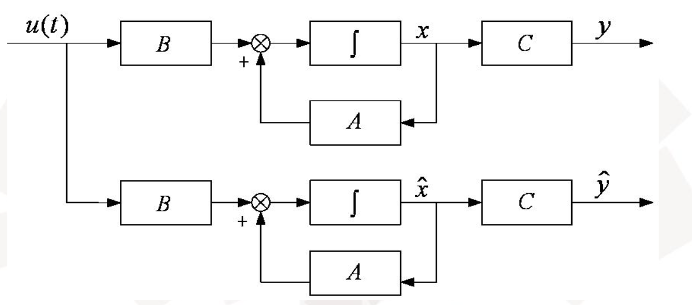

然而在实际中，这种方法是完全不行的，因为有如下缺点：

- 每次使用都必须重新确定原系统的初始状态并对估计器实施设置，极不方便也极不现实。
- 在 $A$ 有正实部特征值的时候，$\Delta\hat{x}(t)$ 最终总要趋向无穷大。令 $\Delta\hat{x}(t)=\hat{x}(t)-x(t)$ 表示状态估计与真实值之间的误差（估计误差）。则有 $\Delta\hat{x}(t) = e^{A(t-t_0)}\Delta\hat{x}(t_0)$ 其最终将趋向于无穷大。

#### 闭环状态估计器

直接上结论：
$$
\dot{\hat{x}}=(\boldsymbol{A}-\boldsymbol{E} C) \hat{\boldsymbol{x}}+\boldsymbol{B} u+\boldsymbol{E} y
$$
由于 $(A-EC)$ 的特征值等于 $(A^T-C^TE^T)$ 的特征值，观测器中 $(A-EC)$ 的特征值配置问题等价于对偶系统中极点配置问题。

前面的定理已经指出：只要 $(A, B)$ 是状态完全能控的，就可以适当选择矩阵 $K$ 来任意地配置 $(A-BK)$ 的特征值。从而不难看出，只要 $(C, A)$ 状态完全能观测，就能通过选择矩阵 $E$ 来任意配置 $(A-EC)$ 的特征值。

==**‼️定理：**==
若n维线性定常系统状态完全能观测，则存在n维（全维）状态观测器：
$$
\dot{\hat{x}}=(A-E C) \hat{x}+B u+E y
$$
其估计误差 $\Delta \hat{\boldsymbol{x}}=\hat{\boldsymbol{x}}-\boldsymbol{x}$，满足 $\Delta \dot{\hat{x}}=(A-E C) \Delta \hat{\boldsymbol{x}}$ 

在复共轭特征值成堆出现的条件下，可以选择矩阵 $E$ 来任意配置 $(A-EC)$ 的特征值。

==‼️**计算的步骤：**==和极点配置的完全一样，直接看例题就行了。

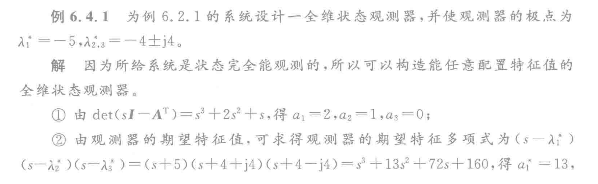

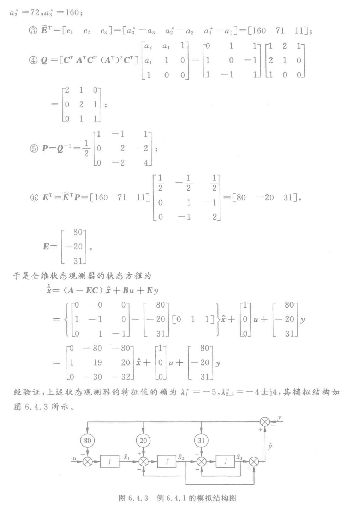

所以和极点配置是完全一样的。

这个图也很重要，要注意‼️

### 6.4.3 降维状态观测器

==**‼️解题步骤：**==

1. 先算矩阵 $ \boldsymbol{P}=\left[\begin{array}{l}
   D \\
   C
   \end{array}\right]$，其中 $D$ 是任取的，使得 $P$ 非奇异就行了，$C$ 就是原系统的 $C$。

2. 对原系统的 $A$ 和 $B$ 做等价变换（$\bar{A} = PAP^{-1}$，$B = PB$），得到 $\bar{A}_{11}, \bar{A}_{12}, \bar{A}_{21}, \bar{A}_{22}, \bar{B}_{1}, \bar{B}_{2}$。一共六个值。

3. 求出期望多项式 $\alpha^*(s)$。

4. 求出行列式 $\operatorname{det}(sI-(\bar{A}_{11}-\bar{E}\bar{A}_{21})) = \alpha(s)$。

5. 然后对比上面两个多项式就能求出 $\bar{E}$。

6. 构造需要观测部分的系统 $w$

   使用公式p224(6.4.13) 

   $\begin{aligned}
   \dot{\boldsymbol{w}}=\dot{\hat{\boldsymbol{x}}}_{1}-\overline{\boldsymbol{E}} \dot{\boldsymbol{y}}= & \left(\overline{\boldsymbol{A}}_{11}-\overline{\boldsymbol{E A}}_{21}\right) w+\left(\overline{\boldsymbol{B}}_{1}-\overline{\boldsymbol{E B}}_{2}\right) \boldsymbol{u} \\
   & +\left[\overline{\boldsymbol{A}}_{12}-\overline{\boldsymbol{E A}}_{22}+\left(\overline{\boldsymbol{A}}_{11}-\overline{\boldsymbol{E A}}_{21}\right) \overline{\boldsymbol{E}}\right] \boldsymbol{y}
   \end{aligned}$  **这个是重要公式‼️**

7. 利用 $w$ 构造整个观测系统：
   使用公式p224(6.4.14)和(6.4.15)

   $\hat{\bar{x}}=\left[\begin{array}{c}
   \hat{\boldsymbol{x}}_{1} \\
   \boldsymbol{y}
   \end{array}\right]=\left[\begin{array}{c}
   w+\overline{\boldsymbol{E}} \boldsymbol{y} \\
   \boldsymbol{y}
   \end{array}\right]=\left[\begin{array}{cc}
   \boldsymbol{I} & \overline{\boldsymbol{E}} \\
   \mathbf{0} & \boldsymbol{I}
   \end{array}\right]\left[\begin{array}{l}
   w \\
   \boldsymbol{y}
   \end{array}\right]$ 和 $\hat{x} = P^{-1}\hat{\bar{x}}$ **这个也是重要公式‼️**

**重要例题：**

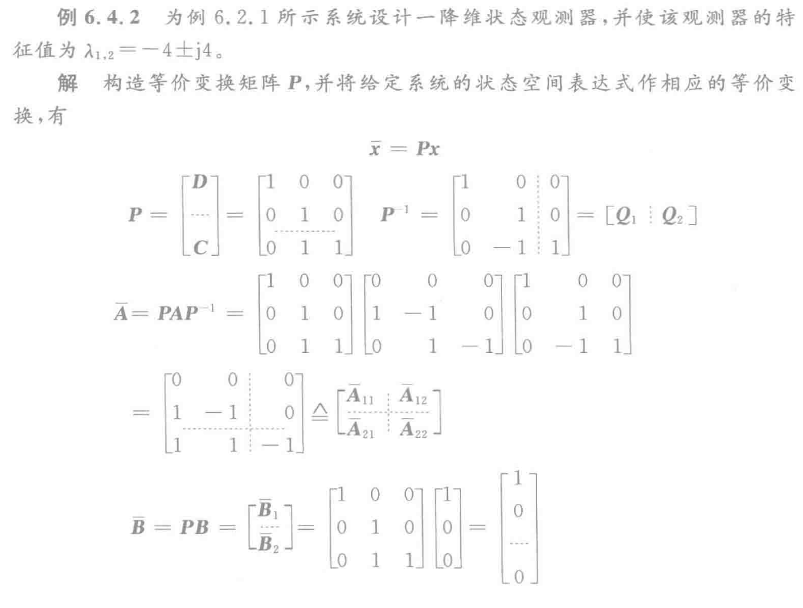

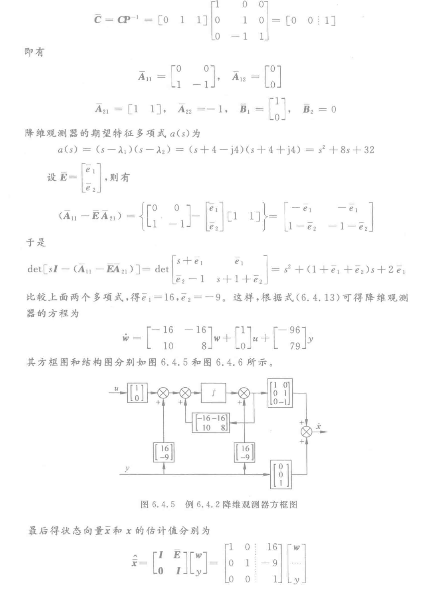

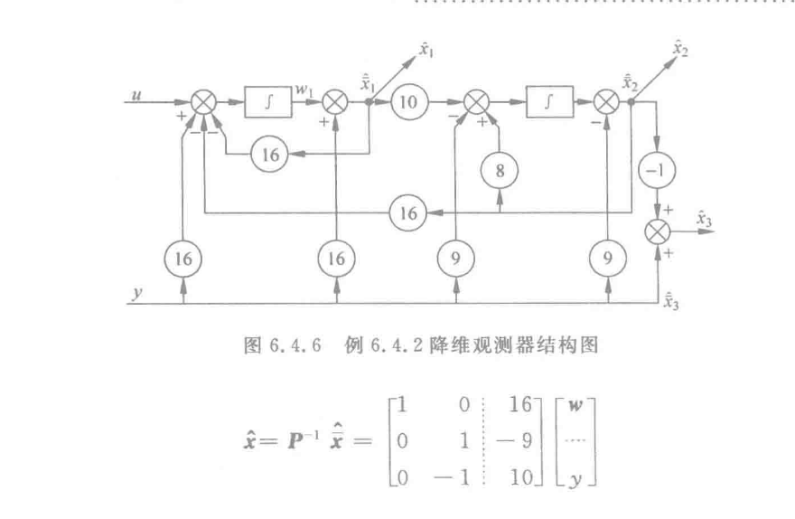

## 6.5 带状态观测器的反馈系统

通过上面的知识。当状态向量 $x(t)$ 不能或不放拜年得到的时候，可通过观测器获取它的估计值 $\hat{x}(t)$，并且用 $\hat{x}(t)$ 代替 $x(t)$ 完成反馈任务。在这种情况下，实际上反馈控制率为 $u=v-K\hat{x}$

**两个问题：**

- 配置 $(A-BK)$ 的特征值是 $u=v-Kx$ 前提下进行的。用 $\hat{x}(t)$ 代替 $x(t)$ 实施反馈，对设计结果是否有影响？
- 状态观测器本身的特性是否会受到影响？

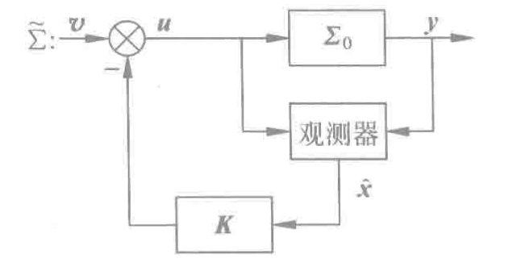

设给定系统的状态空间表达式为：
$$
\Sigma_{0}:\left\{\begin{array}{l}
\dot{x}=A x+B u \\
y=C x
\end{array}\right.
$$
其状态观测器系统的状态空间表达式为：
$$
\Sigma_{ob}:\left\{\begin{array}{l}
\dot{\hat{x}}=(\boldsymbol{A}-\boldsymbol{E} C) \hat{x}+B u+E y \\
\hat{y}=C \hat{x}
\end{array}\right.
$$
所以上面图表示的系统状态空间表达式为：
$$
\widetilde{\Sigma}:\left\{\begin{array}{l}
\dot{x}=\boldsymbol{A} \boldsymbol{x}-\boldsymbol{B K} \hat{x}+\boldsymbol{B} v \\
\dot{\hat{x}}=(\boldsymbol{A}-\boldsymbol{B K}-\boldsymbol{E C}) \hat{x}+\boldsymbol{E} C x+B v \\
\boldsymbol{y}=\boldsymbol{C} x
\end{array}\right.
$$
改写成矩阵形式为：
$$
\widetilde{\Sigma}:\left\{\begin{array}{l}
{\left[\begin{array}{l}
\dot{x} \\
\dot{\hat{x}}
\end{array}\right]=\left[\begin{array}{cc}
\boldsymbol{A} & -\boldsymbol{B} K \\
\boldsymbol{E} & \boldsymbol{A}-\boldsymbol{B} K-E C
\end{array}\right]\left[\begin{array}{l}
x \\
\hat{x}
\end{array}\right]+\left[\begin{array}{l}
\boldsymbol{B} \\
\boldsymbol{B}
\end{array}\right] v \triangleq \tilde{\boldsymbol{A}} \tilde{\boldsymbol{x}}+\widetilde{\boldsymbol{B}} v} \\
y=\left[\begin{array}{ll}
\boldsymbol{C} & 0
\end{array}\right]\left[\begin{array}{l}
x \\
\hat{x}
\end{array}\right] \triangleq \widetilde{\boldsymbol{C}} \tilde{x}
\end{array}\right.
$$
==**讨论：**==

**引入观测器后提高了反馈系统的维数，即系统的阶次**
$$
\operatorname{dim}(\tilde{\Sigma})=\operatorname{dim}\left(\Sigma_{0}\right)+\operatorname{dim}\left(\Sigma_{\mathrm{ob}}\right)
$$
**$\tilde{\Sigma}$ 的特征值集合具有分离性‼️，即：**
$$
\tilde{\Sigma} \text { 的特征值集合 }=\left\{\begin{array}{ll}
\lambda_{i}(A-B K), & i=1,2, \cdots, n \\
\lambda_{j}(A-E C), & j=1,2, \cdots, n
\end{array}\right\}
$$
闭环系统 $\tilde{\Sigma}$ 的特征值集合是 $(A-BK)$ 与 $(A-EC)$ 的特征值集合的并集。也就是说，系统 $\tilde{\Sigma}$ 的极点由用真实状态 $x$ 进行状态反馈所构成的闭环极点和观测器本身的极点所组成‼️

**观测器的引入，不影响已经配置好的系统特征值，而状态反馈也不影响观测器的特征值。**

==**即控制系统的动态特性与观测器的动态特性是相互独立的。从而使得系统的极点配置和状态观测器的设计可以分开独立地进行。这一结论称为分离定理‼️**==

==**观测器的引入不改变原来状态反馈系统的闭环传递函数矩阵‼️**==

一般来说，带观测器的状态反馈系统在鲁棒性上要比用真实状态 $x(t)$ 反馈的系统要差。

**p232的例6.5.1是重要例题**
