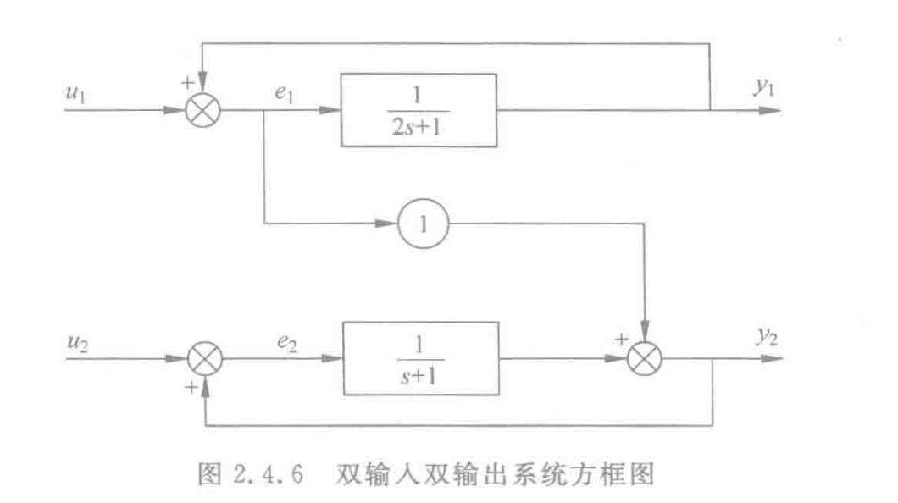

# 2. 第二章

## 2.0 重点

- 根据状态空间表达式求系统的传递函数，由高阶微分方程化为状态空间描述
- 根据方框图列写系统的状态空间表达式，传递函数矩阵的不变性p35，p51‼️

## 2.1 基本概念

状态变量，状态向量，状态空间，状态方程，状态空间表达式的概念

**非线性系统的状态空间描述**
$$
\left\{\begin{array}{l}
\dot{x}=f(x, u, t) \\
y=g(x, u, t)
\end{array}\right.
$$
**线性系统的状态空间描述**
$$
\left\{\begin{array}{l}
\dot{\boldsymbol{x}}=\boldsymbol{A}(t) \boldsymbol{x}+\boldsymbol{B}(t) \boldsymbol{u} \\
\boldsymbol{y}=\boldsymbol{C}(t) \boldsymbol{x}+\boldsymbol{D}(t) \boldsymbol{u}
\end{array}\right.
$$
带t是时变的，不带t就是定常。

**离散系统的状态空间描述**
$$
\left\{\begin{array}{l}
\boldsymbol{x}(k+1)=\boldsymbol{f}(\boldsymbol{x}(k), \boldsymbol{u}(k), k), \\
\boldsymbol{y}(k)=\boldsymbol{g}(\boldsymbol{x}(k), \boldsymbol{u}(k), k),
\end{array} \quad k=0,1,2, \cdots\right.
$$
如果是线性的
$$
\left\{\begin{array}{l}
\boldsymbol{x}(k+1)=\boldsymbol{G}(k) \boldsymbol{x}(k)+\boldsymbol{H}(k) \boldsymbol{x}(k), \\
\boldsymbol{y}(k)=\boldsymbol{C}(k) \boldsymbol{x}(k)+\boldsymbol{D}(k) \boldsymbol{u}(k),
\end{array} \quad k=0,1,2, \cdots\right.
$$
**写状态空间表达式的时候，写状态方程的时候：**微分放左边，没有微分的放右边

**状态空间描述非唯一性：**

这个要记住怎么用P变换的公式
$$
\begin{array}{l}
\dot{x}=A x+B u \\
y=C x
\end{array}
$$

$$
\begin{aligned}
\dot{\bar{x}} & =\boldsymbol{P}^{-1} \dot{\boldsymbol{x}}=\boldsymbol{P}^{-1}[\boldsymbol{A} \boldsymbol{x}+\boldsymbol{B} u] \\
& =\boldsymbol{P}^{-1} \boldsymbol{A P} \overline{\boldsymbol{x}}+\boldsymbol{P}^{-1} \boldsymbol{B} u=\overline{\boldsymbol{A}} \overline{\boldsymbol{x}}+\overline{\boldsymbol{B}} u \\
\boldsymbol{y} & =\boldsymbol{C} \boldsymbol{x}=\boldsymbol{C} \overline{\boldsymbol{x}}=\overline{\boldsymbol{C}} \overline{\boldsymbol{x}}
\end{aligned}
$$

$$
\overline{\boldsymbol{A}}=\boldsymbol{P}^{-1} \boldsymbol{A P}, \quad \overline{\boldsymbol{B}}=\boldsymbol{P}^{-1} \boldsymbol{B}, \quad \overline{\boldsymbol{C}}=\boldsymbol{C P}
$$

最后这个公式很重要！==记住，A是前逆后不逆，B是前逆，C是后不逆。==

**如何画状态变量图：**先画积分器，再画其他的。

例子：
$$
\left\{\begin{array}{l}
\dot{x}_{1}=a_{11} x_{1}+a_{12} x_{2}+b_{11} u_{1}+b_{12} u_{2} \\
\dot{x}_{2}=a_{21} x_{1}+a_{22} x_{2}+b_{21} u_{1}+b_{22} u_{2}
\end{array}\right.
$$

## 2.2 传递函数与传递函数矩阵

**单输入单输出系统**

直接看结论
$$
\left\{\begin{array}{l}
\dot{x}=A x+B u \\
y=C x+D u
\end{array}\right.
$$

$$
g(s)=\frac{Y(s)}{U(s)}=\boldsymbol{C}(s \boldsymbol{I}-\boldsymbol{A})^{-1} \boldsymbol{B}+D
$$

一些结论：

- 系统矩阵A的特征多项式就是传递函数的的分母多项式。
- 传递函数的极点就是矩阵A的特征值。
- 多项式  $\boldsymbol{C a d j}(s \boldsymbol{I}-\boldsymbol{A}) \boldsymbol{B}$ 与 $D|s \boldsymbol{I}-\boldsymbol{A}|$之和即为传递函数的分子多项式$N(s)$。
- 状态变量不同，同一系统的状态空间描述是不唯一的，但是传递函数是唯一的。

**多输入多输出也是一样的**

## 2.3 状态空间表达式的建立

### 2.3.1 从物理系统直接建立

### 2.3.2 从高阶微分方程建立

**高阶微分方程的写法：**
$$
\begin{aligned}
& y^{(n)}+a_{1} y^{(n-1)}+a_{2} y^{(n-2)}+\cdots+a_{n-1} \dot{y}+a_{n} y \\
= & b_{0} u^{(m)}+b_{1} u^{(m-1)}+\cdots+b_{m-1} \dot{u}+b_{m} u
\end{aligned}
$$
要注意，左边是没有$a_0$的，是从$a_1$开始，然后左边最高阶项系数一定是1。

然后右边是有$b_0$的。

#### m<n时

**当微分方程右边不含输入函数的导数的情况，即$m=0$时：**
$$
y^{(n)}+a_{1} y^{(n-1)}+a_{2} y^{(n-2)}+\cdots+a_{n-1} \dot{y}+a_{n} y=u
$$
这个直接记结论：

选取状态变量：
$$
\left\{\begin{array}{c}
x_{1}=y \\
x_{2}=\dot{y} \\
\vdots \\
x_{n}=y^{(n-1)}
\end{array}\right.
$$
得到表达式：
$$
\left\{\begin{aligned}
\dot{x}_{1} & =x_{2} \\
\dot{x}_{2} & =x_{3} \\
& \vdots \\
\dot{x}_{n} & =-a_{n} x_{1}-a_{n-1} x_{2}-\cdots-a_{1} x_{n}+u
\end{aligned}\right.
$$
输出方程：
$$
y=x_1
$$
==所以此时的状态空间描述：==
$$
\begin{aligned}
\dot{x} & =\left[\begin{array}{cccc}
0 & 1 & \cdots & 0 \\
\vdots & \vdots & \ddots & \vdots \\
0 & 0 & \cdots & 1 \\
-a_{n} & -a_{n-1} & \cdots & -a_{1}
\end{array}\right] x+\left[\begin{array}{l}
0 \\
0 \\
0 \\
1
\end{array}\right] u \\
y & =[1,0, \cdots, 0,0, \cdots, 0] x
\end{aligned}
$$
这个要记住！

**当微分方程右边含输入函数的导数的情况，即$m!=0$时：**

这里要引入算子符号来讨论，具体可以见p23

**如果$m<n$的时候**

**能控制标准型：**
$$
\begin{array}{c}
\dot{\boldsymbol{x}}=\boldsymbol{A} \boldsymbol{x}+\boldsymbol{B} u=\left[\begin{array}{cccc}
0 & 1 & \cdots & 0 \\
\vdots & \vdots & \ddots & \vdots \\
0 & 0 & \cdots & 1 \\
-a_{n} & -a_{n-1} & \cdots & -a_{1}
\end{array}\right] \boldsymbol{x}+\left[\begin{array}{l}
0 \\
0 \\
0 \\
1
\end{array}\right] u \\
y=\boldsymbol{C} \boldsymbol{x}=\left[b_{m}, \cdots, b_{0}, 0, \cdots, 0\right] \boldsymbol{x}
\end{array}
$$
比如：
$$
y^{(3)}+16 y^{(2)}+194 y^{(1)}+640 y=160 u^{(1)}+720 u
$$
的==能控标准型：重要‼️p24==
$$
\begin{array}{l}
{\left[\begin{array}{l}
\dot{x}_{1} \\
\dot{x}_{2} \\
\dot{x}_{3}
\end{array}\right]=\left[\begin{array}{ccc}
0 & 1 & 0 \\
0 & 0 & 1 \\
-640 & -194 & -16
\end{array}\right] x+\left[\begin{array}{l}
0 \\
0 \\
1
\end{array}\right] u} \\
y=\left[\begin{array}{lll}
720 & 160 & 0
\end{array}\right]\left[\begin{array}{l}
x_{1} \\
x_{2} \\
x_{3}
\end{array}\right]
\end{array}
$$
**能观标准型：**
$$
\begin{array}{c}
\dot{\boldsymbol{x}}=\boldsymbol{A} \boldsymbol{x}+\boldsymbol{B} u=\left[\begin{array}{ccccc}
0 & 0 & \cdots & 0 & -a_{n} \\
1 & 0 & \cdots & 0 & -a_{n-1} \\
0 & 1 & \cdots & 0 & -a_{n-2} \\
\vdots & \vdots & \ddots & \vdots & \vdots \\
0 & 0 & \cdots & 1 & -a_{1}
\end{array}\right] \boldsymbol{x}+\left[\begin{array}{c}
b_{m} \\
b_{m-1} \\
\vdots \\
b_{0} \\
0 \\
\vdots \\
0
\end{array}\right] u \\
\boldsymbol{y}=\boldsymbol{C}=\left[\begin{array}{llll}
0 & 0 & \cdots & 1
\end{array}\right] \boldsymbol{x}
\end{array}
$$
==能观的A是能控的A的转置，能观的C是能控的B的转置，能观的B是能控的C的转置==
$$
\begin{aligned}
\boldsymbol{A}_{\mathrm{c}}^{\mathrm{T}} & =\boldsymbol{A}_{\circ} \\
\boldsymbol{B}_{\mathrm{c}}^{\mathrm{T}} & =\boldsymbol{C}_{\circ}
\end{aligned}
$$

#### m=n时

$$
\begin{array}{l}
\dot{\boldsymbol{x}}=\left[\begin{array}{ccccc}
0 & 1 & 0 & \cdots & 0 \\
0 & 0 & 1 & \cdots & 0 \\
\vdots & \vdots & \vdots & \ddots & \vdots \\
0 & 0 & 0 & \cdots & 1 \\
-a_{n} & -a_{n-1} & -a_{n-2} & \cdots & -a_{1}
\end{array}\right] \boldsymbol{x}+\left[\begin{array}{l}
0 \\
0 \\
0 \\
1
\end{array}\right] u \\
y=\left[\begin{array}{lll}
\left(b_{n}-b_{0} a_{n}\right) & \cdots & \left(b_{1}-b_{0} a_{1}\right)
\end{array}\right] x+b_{0} u \\
\end{array}
$$

例子：
$$
y^{(3)}+16 y^{(2)}+194 y^{(1)}+640 y=4 u^{(3)}+160 u^{(1)}+720 u
$$
结果：
$$
\begin{array}{l}
{\left[\begin{array}{c}
\dot{x}_{1} \\
\dot{x}_{2} \\
\dot{x}_{3}
\end{array}\right]=\left[\begin{array}{ccc}
0 & 1 & 0 \\
0 & 0 & 1 \\
-640 & -194 & -16
\end{array}\right] x+\left[\begin{array}{l}
0 \\
0 \\
1
\end{array}\right] u} \\
y=\left[\begin{array}{lll}
-1840 & -616 & -64
\end{array}\right]\left[\begin{array}{l}
x_{1} \\
x_{2} \\
x_{3}
\end{array}\right]+4 u
\end{array}
$$
==遇到这种题，一定要把a3, a2, a1, b3, b2, b1, b0都列出来！==

### 2.3.3 由传递函数建立

g(s)要求是真分式，如果m=n，就要把常数项化出来。

只有当m=n的时候，才会有输入与输出间的直接传递项，一般情况都是严格真分式。

一般也是只讨论真分式。
$$
g(s)=\frac{Y(s)}{U(s)}=\frac{b_{1} s^{n-1}+\cdots+b_{n-1} s+b_{n}}{s^{n}+a_{1} s^{n-1}+\cdots+a_{n-1} s+a_{n}}
$$

#### 直接分解

直接分解的推导过程我觉得要会。

今选择各个积分器的输出作为系统的状态变量 $x_{1}, x_{2}, \cdots, x_{n}$, 于是状态空间表达式为：
$$
\left[\begin{array}{c}
\dot{x}_{1} \\
\dot{x}_{2} \\
\vdots \\
\dot{x}_{n}
\end{array}\right]=\left[\begin{array}{ccccc}
0 & 1 & 0 & \cdots & 0 \\
0 & 0 & 1 & \cdots & 0 \\
\vdots & \vdots & \vdots & \ddots & \vdots \\
0 & 0 & 0 & \cdots & 1 \\
-a_{n} & -a_{n-1} & -a_{n-2} & \cdots & -a_{1}
\end{array}\right]\left[\begin{array}{c}
x_{1} \\
x_{2} \\
\vdots \\
x_{n}
\end{array}\right]+\left[\begin{array}{c}
0 \\
\vdots \\
0 \\
1
\end{array}\right] u \\
y=\left[\begin{array}{llll}
b_{n} & b_{n-1} & \cdots & b_{1}
\end{array}\right]\left[\begin{array}{c}
x_{1} \\
x_{2} \\
\vdots \\
x_{n}
\end{array}\right]
$$
==要注意啊，现在这种表达式，公式25刚好分子比分母少一项，上面是b1-bn, 下面是a1-an要注意。==

#### 串联分解

$$
g(s)=\frac{b_{1}\left(s-z_{1}\right)\left(s-z_{2}\right) \cdots\left(s-z_{n-1}\right)}{\left(s-p_{1}\right)\left(s-p_{2}\right) \cdots\left(s-p_{n}\right)}
$$

要注意，上面刚好比下面少一维！
$$
\begin{aligned}
g(s) & =\frac{Y(s)}{U(s)}=\frac{b_{1}\left(s-z_{2}\right)\left(s-z_{3}\right)}{\left(s-p_{1}\right)\left(s-p_{2}\right)\left(s-p_{3}\right)} \\
& =\frac{b_{1}}{\left(s-p_{1}\right)} \frac{\left(s-z_{2}\right)}{\left(s-p_{2}\right)} \frac{\left(s-z_{3}\right)}{\left(s-p_{3}\right)}
\end{aligned}
$$
要记住两种表达式对应的画法！

==这个分别对应两种画法！要记住！左边这个是 $\frac{b_1}{s-p_1}$，右边这个是 $\frac{s-z_2}{s-p_2}$，这个要记住。==

状态变量就是每个积分器的输出。
$$
\begin{array}{c}
\left[\begin{array}{l}
\dot{x}_{1} \\
\dot{x}_{2} \\
\dot{x}_{3}
\end{array}\right]=\left[\begin{array}{ccc}
p_{1} & 0 & 0 \\
1 & p_{2} & 0 \\
1 & p_{2}-z_{2} & p_{3}
\end{array}\right]\left[\begin{array}{l}
x_{1} \\
x_{2} \\
x_{3}
\end{array}\right]+\left[\begin{array}{l}
b_{1} \\
0 \\
0
\end{array}\right] u \\
y=\left[\begin{array}{lll}
1 & p_{2}-z_{2} & p_{3}-z_{3}
\end{array}\right]\left[\begin{array}{l}
x_{1} \\
x_{2} \\
x_{3}
\end{array}\right]
\end{array}
$$
结论直接记住！

#### 并联分解

这个很好记，就是对角+若尔当型。

**传递函数的极点互不相同的情况：对角形**

注意：如何求c？
$$
c_{i}=\lim \left(s-p_{i}\right) g(s), \quad i=1,2, \cdots, n
$$

$$
g(s)=\frac{c_{1}}{s-p_{1}}+\frac{c_{2}}{s-p_{2}}+\cdots+\frac{c_{n}}{s-p_{n}}
$$
推导过程看看书p31
$$
\begin{array}{c}
\left[\begin{array}{c}
\dot{x}_{1} \\
\dot{x}_{2} \\
\vdots \\
\dot{x}_{n}
\end{array}\right]=\left[\begin{array}{cccc}
p_{1} & 0 & \cdots & 0 \\
0 & p_{2} & \cdots & 0 \\
\vdots & \vdots & \ddots & \vdots \\
0 & 0 & \cdots & p_{n}
\end{array}\right]\left[\begin{array}{c}
x_{1} \\
x_{2} \\
\vdots \\
x_{n}
\end{array}\right]+\left[\begin{array}{c}
1 \\
1 \\
\vdots \\
1
\end{array}\right] u \\
y=\left[\begin{array}{llll}
c_{1} & c_{2} & \cdots & c_{n}
\end{array}\right]\left[\begin{array}{c}
x_{1} \\
x_{2} \\
\vdots \\
x_{n}
\end{array}\right]
\end{array}
$$
这个就是结论，直接记住，就是对角型。

**传递函数具有重极点的情况**

就是若尔当+对角

注意，如何求c？
$$
c_{1 j}=\frac{1}{(j-1)!} \lim _{s \rightarrow p_{1}} \frac{\mathrm{d}^{j-1}}{\mathrm{~d} s^{j-1}}\left\{\left(s-p_{1}\right)^{r} g(s)\right\}, \quad j=1,2, \cdots, r
$$

$$
\begin{aligned}
g(s)= & \frac{c_{11}}{\left(s-p_{1}\right)^{r}}+\frac{c_{12}}{\left(s-p_{1}\right)^{r-1}}+\cdots+\frac{c_{1 r}}{s-p_{1}} \\
& +\frac{c_{r+1}}{s-p_{r+1}}+\cdots+\frac{c_{n}}{s-p_{n}}
\end{aligned}
$$

要记住，重根重了多少维，若尔当块就是几维的。

#### 重要例题

$$
g(s)=\frac{2 s^{2}+5 s+1}{s^{3}-6 s^{2}+12 s-8}
$$

$$
\begin{array}{l}
c_{11}=\lim _{s \rightarrow 2}\left(s-p_{i}\right)^{3} g(s)=\lim _{t \rightarrow 2}\left(2 s^{2}+5 s+1\right)=19 \\
c_{12}=\lim _{s \rightarrow 2} \frac{\mathrm{d}}{\mathrm{d} s}\left[\left(s-p_{i}\right)^{3} g(s)\right]=\lim _{t \rightarrow 2}(4 s+5)=13 \\
c_{13}=\frac{1}{2!} \lim _{s \rightarrow 2} \frac{\mathrm{d}^{2}}{\mathrm{~d} s^{2}}\left[\left(s-p_{i}\right)^{3} g(s)\right]=\lim _{t \rightarrow 2} \frac{4}{2!}=2
\end{array}
$$

==这一部分求c的过程很重要！要记住，要复习！p34‼️==

- c11-c13是从阶数从3-1的

- 然后c11前面要乘一个$\frac{1}{0!}$从0开始的，c12前面$\frac{1}{1!}$，c13前面$\frac{1}{2!}$

- 然后c11里面是0次导，c12是1次导，c13是2次导

- 里面都有一个$(s-2)^3$

## 2.4 组合系统的状态空间表达式

多个系统的状态空间表达式和传递函数矩阵分别为：
$$
\Sigma_{i}: \begin{array}{l}
\dot{x}_{i}=\boldsymbol{A}_{i} \boldsymbol{x}_{i}+\boldsymbol{B}_{i} \boldsymbol{u}_{i} \\
\boldsymbol{y}_{i}=\boldsymbol{C}_{i} \boldsymbol{x}_{i}+\boldsymbol{D}_{i} \boldsymbol{u}_{i}
\end{array}, \quad i=1,2
$$

$$
G_i(s)
$$

### 2.4.1 并联

直接记结论：

状态空间：
$$
\begin{array}{c}
\Sigma_{\mathrm{p}}:\left[\begin{array}{l}
\dot{\boldsymbol{x}}_{1} \\
\dot{\boldsymbol{x}}_{2}
\end{array}\right]=\left[\begin{array}{cc}
\boldsymbol{A}_{1} & \mathbf{0} \\
\mathbf{0} & \boldsymbol{A}_{2}
\end{array}\right]\left[\begin{array}{l}
\boldsymbol{x}_{1} \\
\boldsymbol{x}_{2}
\end{array}\right]+\left[\begin{array}{l}
\boldsymbol{B}_{1} \\
\boldsymbol{B}_{2}
\end{array}\right] \boldsymbol{u} \\
\boldsymbol{y}=\left[\begin{array}{ll}
\boldsymbol{C}_{1} & \boldsymbol{C}_{2}
\end{array}\right]\left[\begin{array}{l}
\boldsymbol{x}_{1} \\
\boldsymbol{x}_{2}
\end{array}\right]+\left[\boldsymbol{D}_{1}+\boldsymbol{D}_{2}\right] \boldsymbol{u}
\end{array}
$$
传递函数：
$$
G(s) = \sum_{i=1}^{N} \boldsymbol{G}_{i}(s)
$$

### 2.4.2 串联

要满足要求，**前一个的输出维度要等于后一个的输入维度，这个也很好理解，不然矩阵搞不到一起**

状态空间：
$$
\begin{array}{c}
\Sigma_{\mathrm{T}}:\left[\begin{array}{l}
\dot{\boldsymbol{x}}_{1} \\
\dot{\boldsymbol{x}}_{2}
\end{array}\right]=\left[\begin{array}{cc}
\boldsymbol{A}_{1} & 0 \\
\boldsymbol{B}_{2} \boldsymbol{C}_{1} & \boldsymbol{A}_{2}
\end{array}\right]\left[\begin{array}{l}
\boldsymbol{x}_{1} \\
\boldsymbol{x}_{2}
\end{array}\right]+\left[\begin{array}{c}
\boldsymbol{B}_{1} \\
\boldsymbol{B}_{2} \boldsymbol{D}_{1}
\end{array}\right] \boldsymbol{u} \\
\boldsymbol{y}=\left[\begin{array}{ll}
\boldsymbol{D}_{2} \boldsymbol{C}_{1} & \boldsymbol{C}_{2}
\end{array}\right]\left[\begin{array}{l}
\boldsymbol{x}_{1} \\
\boldsymbol{x}_{2}
\end{array}\right]+\boldsymbol{D}_{2} \boldsymbol{D}_{1} \boldsymbol{u}
\end{array}
$$
传递函数：
$$
G(s) = G_1(s)G_2(s)
$$

### 2.4.3 反馈

要求：
$$
dim(y_1) = dim(u_2) 和 dim(y_2)=dim(u_1)
$$
这个都是很好理解的。

#### 动态反馈

**直接记住结论：**

状态方程：
$$
\begin{array}{l}
{\left[\begin{array}{l}
\dot{x}_{1} \\
\dot{\boldsymbol{x}}_{2}
\end{array}\right]=\left[\begin{array}{cc}
\boldsymbol{A}_{1} & -\boldsymbol{B}_{1} \boldsymbol{C}_{2} \\
\boldsymbol{B}_{2} \boldsymbol{C}_{1} & \boldsymbol{A}_{2}
\end{array}\right]\left[\begin{array}{l}
\boldsymbol{x}_{1} \\
\boldsymbol{x}_{2}
\end{array}\right]+\left[\begin{array}{c}
\boldsymbol{B}_{1} \\
\mathbf{0}
\end{array}\right] \boldsymbol{u}} \\
\boldsymbol{y}=\left[\begin{array}{ll}
\boldsymbol{C}_{1} & \mathbf{0}
\end{array}\right]\left[\begin{array}{l}
\boldsymbol{x}_{1} \\
\boldsymbol{x}_{2}
\end{array}\right]
\end{array}
$$
传递函数：
$$
\begin{align}
\boldsymbol{G}(s) & = \boldsymbol{G}_{1}(s)\left[\boldsymbol{I}+\boldsymbol{G}_{2}(s) \boldsymbol{G}_{1}(s)\right]^{-1} \\
\boldsymbol{G}(s) & = \left[\boldsymbol{I}+\boldsymbol{G}_{1}(s) \boldsymbol{G}_{2}(s)\right]^{-1} \boldsymbol{G}_{1}(s)
\end{align}
$$
==要记住，很重要！注意1和2的顺序！==

如果逆矩阵在前面，就是1在前面，如果逆矩阵在后面，就是2在前面。

#### 常数反馈

$$
\left\{\begin{aligned}
\dot{x} & =A x+B(u-H y) \\
& =(A-B H C) x+B u \\
y & =C x
\end{aligned}\right.
$$

$$
\begin{array}{c}
\boldsymbol{G}(s)=\boldsymbol{G}_{0}(s)\left[\boldsymbol{I}+\boldsymbol{H} \boldsymbol{G}_{0}(s)\right]^{-1} \\ \boldsymbol{G}(s)=\left[\boldsymbol{I}+\boldsymbol{G}_{0}(s) \boldsymbol{H}\right]^{-1} \boldsymbol{G}_{0}(s)
\end{array}
$$

要记住结论！

### 2.4.4 重要例题

==记住，误差函数e1，e2很重要，他就是矩阵A的构成！==

## 2.5 线性变换

这一部分很重要，估计有计算题

### 2.5.2 化成对角型

这一部分比较熟悉了，求P即可，然后一定有n个特征值（互不相同），这个很熟了

就需要注意一个特殊情况。

如果矩阵A是友矩阵，可以直接得出P是Vandermonde矩阵。

比如p47的例题。
$$
\boldsymbol{A}=\left[\begin{array}{ccccc}
0 & 1 & 0 & \cdots & 0 \\
0 & 0 & 1 & \cdots & 0 \\
\vdots & \vdots & \vdots & \ddots & \vdots \\
0 & 0 & 0 & \cdots & 1 \\
-a_{n} & -a_{n-1} & -a_{n-2} & \cdots & -a_{1}
\end{array}\right] \Rightarrow \boldsymbol{P}=\left[\begin{array}{cccc}
1 & 1 & \cdots & 1 \\
\lambda_{1} & \lambda_{2} & \cdots & \lambda_{n} \\
\lambda_{1}^{2} & \lambda_{2}^{2} & \cdots & \lambda_{n}^{2} \\
\vdots & \vdots & \ddots & \vdots \\
\lambda_{1}^{n-1} & \lambda_{2}^{n-1} & \cdots & \lambda_{n}^{n-1}
\end{array}\right]
$$

### 2.5.3 化成Jordan型

这一部分也是比较熟悉的，要注意：

- 有重根也有可能化成对角，p49
- 求广义特征向量的方法，p50‼️

### 2.5.4 特征值和传递函数矩阵的不变性

这个证明很简单。

原来是：
$$
\boldsymbol{G}(s)=\boldsymbol{C}(s \boldsymbol{I}-\boldsymbol{A})^{-1} \boldsymbol{B}+\boldsymbol{D}
$$
现在是：
$$
\overline{\boldsymbol{G}}(s)=\overline{\boldsymbol{C}}(s \boldsymbol{I}-\overline{\boldsymbol{A}})^{-1} \overline{\boldsymbol{B}}+\overline{\boldsymbol{D}}
$$
带进去就能证明：
$$
\begin{aligned}
\overline{\boldsymbol{G}}(s) & =\overline{\boldsymbol{C}}(s \boldsymbol{I}-\overline{\boldsymbol{A}})^{-1} \overline{\boldsymbol{B}}+\overline{\boldsymbol{D}} \\
& =\boldsymbol{C P}\left(s \boldsymbol{I}-\boldsymbol{P}^{-1} \boldsymbol{A} \boldsymbol{P}\right)^{-1} \boldsymbol{P}^{-1} \boldsymbol{B}+\boldsymbol{D} \\
& =\boldsymbol{C P}\left(s \boldsymbol{P}^{-1} \boldsymbol{P}-\boldsymbol{P}^{-1} \boldsymbol{A} \boldsymbol{P}\right)^{-1} \boldsymbol{P}^{-1} \boldsymbol{B}+\boldsymbol{D} \\
& =\boldsymbol{C P}\left[\boldsymbol{P}^{-1}(s \boldsymbol{I}-\boldsymbol{A}) \boldsymbol{P}\right]^{-1} \boldsymbol{P}^{-1} \boldsymbol{B}+\boldsymbol{D} \\
& =\boldsymbol{C P} \boldsymbol{P}^{-1}(s \boldsymbol{I}-\boldsymbol{A})^{-1} \boldsymbol{P} \boldsymbol{P}^{-1} \boldsymbol{B}+\boldsymbol{D} \\
& =\boldsymbol{C}(s \boldsymbol{I}-\boldsymbol{A})^{-1} \boldsymbol{B}+\boldsymbol{D} \\
& =\boldsymbol{G}(s)
\end{aligned}
$$
特征值的不变性也是一样，带进去就行了，很简单，p52.

## 2.6 离散事件系统的状态空间表达式

一样的

看看p55的例题。

